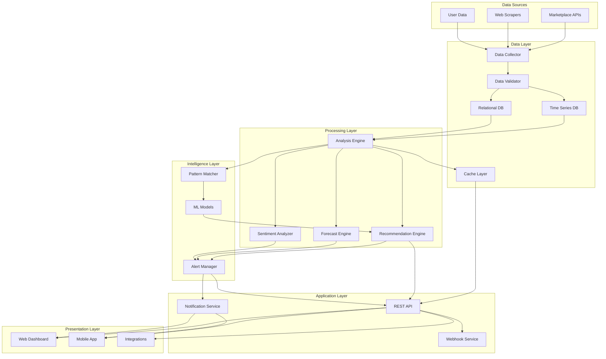
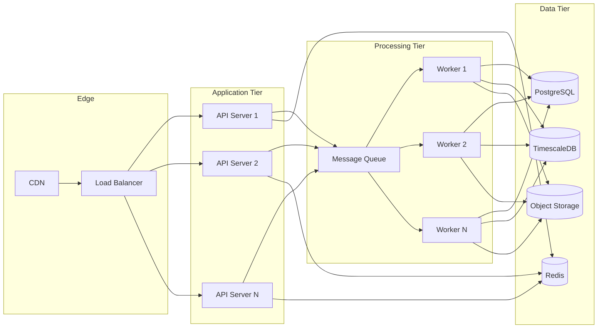

# Design Document: ShelfIQ Commerce Copilot

## Overview

ShelfIQ is an AI-powered commerce intelligence platform that provides actionable insights for retailers and marketplace sellers. The system architecture follows a modular design with clear separation between data collection, analysis, recommendation generation, and user interaction layers.

The platform operates on a continuous data pipeline: collecting market data from multiple sources, processing and analyzing this data to extract insights, generating recommendations and alerts, and presenting actionable intelligence through user interfaces and APIs.

Key design principles:
- **Modularity**: Independent components with well-defined interfaces
- **Scalability**: Horizontal scaling for data processing and API services
- **Real-time responsiveness**: Event-driven architecture for timely alerts
- **Data quality**: Validation and quality checks at every stage
- **Extensibility**: Plugin architecture for new data sources and analysis modules

## Architecture

### High-Level Architecture



### Component Architecture

The system is organized into five primary layers:

1. **Data Layer**: Handles data ingestion, validation, and storage
2. **Processing Layer**: Performs analysis, forecasting, and recommendation generation
3. **Intelligence Layer**: Manages alerts, pattern detection, and machine learning
4. **Application Layer**: Provides APIs, webhooks, and notification services
5. **Presentation Layer**: User interfaces and external integrations

### Deployment Architecture



## Components and Interfaces

### Data Collector

**Responsibility**: Collect data from external sources on schedule

**Interface**:
```
class DataCollector:
    def collect_competitor_prices(marketplace: str, skus: List[str]) -> List[PriceRecord]
    def collect_demand_data(marketplace: str, skus: List[str]) -> List[DemandRecord]
    def collect_seller_performance(marketplace: str, seller_id: str) -> PerformanceRecord
    def collect_reviews(marketplace: str, skus: List[str]) -> List[Review]
    def collect_promotions(marketplace: str, skus: List[str]) -> List[Promotion]
    def schedule_collection(source: str, interval: Duration) -> ScheduleId
```

**Dependencies**: Marketplace APIs, Web Scrapers, Configuration Service

**Data Flow**: External sources → Data Collector → Data Validator → Storage

### Data Validator

**Responsibility**: Validate data quality and completeness before storage

**Interface**:
```
class DataValidator:
    def validate_price_record(record: PriceRecord) -> ValidationResult
    def validate_demand_record(record: DemandRecord) -> ValidationResult
    def validate_review(review: Review) -> ValidationResult
    def check_completeness(record: Any) -> List[MissingField]
    def check_data_freshness(record: Any, max_age: Duration) -> bool
    def deduplicate(records: List[Any]) -> List[Any]
```

**Validation Rules**:
- Price must be positive number
- Timestamps must be valid and recent
- Required fields must be present
- SKU identifiers must match expected format
- Duplicate records are filtered

### Analysis Engine

**Responsibility**: Process collected data and generate insights

**Interface**:
```
class AnalysisEngine:
    def analyze_price_trends(sku: str, period: DateRange) -> PriceTrendAnalysis
    def detect_market_signals(category: str) -> List[MarketSignal]
    def calculate_price_elasticity(sku: str) -> PriceElasticity
    def analyze_competitive_position(sku: str) -> CompetitivePosition
    def identify_anomalies(metric: str, sku: str) -> List[Anomaly]
    def correlate_signals(signals: List[MarketSignal]) -> List[CorrelatedEvent]
```

**Analysis Types**:
- **Trend Analysis**: Moving averages, growth rates, seasonality detection
- **Anomaly Detection**: Statistical outlier detection using z-scores and IQR
- **Correlation Analysis**: Identify relationships between market signals
- **Competitive Analysis**: Position relative to competitors

### Recommendation Engine

**Responsibility**: Generate actionable recommendations based on analysis

**Interface**:
```
class RecommendationEngine:
    def recommend_price(sku: str, context: MarketContext) -> PriceRecommendation
    def recommend_listing_improvements(sku: str) -> List[ListingRecommendation]
    def recommend_growth_actions(seller: str) -> List[GrowthAction]
    def calculate_expected_impact(recommendation: Recommendation) -> ImpactEstimate
    def rank_recommendations(recommendations: List[Recommendation]) -> List[Recommendation]
```

**Recommendation Logic**:
- **Price Recommendations**: Consider competitor prices, demand elasticity, margin targets, and market trends
- **Listing Optimization**: Compare against top-performing listings, identify gaps, suggest improvements
- **Growth Actions**: Prioritize by expected ROI, effort required, and strategic alignment

### Forecast Engine

**Responsibility**: Generate demand forecasts using time series models

**Interface**:
```
class ForecastEngine:
    def forecast_demand(sku: str, horizon: int) -> DemandForecast
    def calculate_confidence_intervals(forecast: DemandForecast) -> ConfidenceIntervals
    def recalibrate_model(sku: str, actual: List[float], predicted: List[float]) -> None
    def incorporate_external_events(forecast: DemandForecast, events: List[Event]) -> DemandForecast
```

**Forecasting Approach**:
- Base model: Seasonal ARIMA or Prophet for time series forecasting
- Incorporate: Historical sales, seasonality, trends, external events
- Confidence intervals: 80% and 95% prediction intervals
- Recalibration: Update models when forecast error exceeds threshold

### Sentiment Analyzer

**Responsibility**: Analyze customer review sentiment and extract themes

**Interface**:
```
class SentimentAnalyzer:
    def analyze_sentiment(review: Review) -> SentimentScore
    def extract_themes(reviews: List[Review]) -> List[Theme]
    def associate_feature_sentiment(reviews: List[Review]) -> Dict[Feature, SentimentScore]
    def detect_sentiment_shift(sku: str, period: DateRange) -> SentimentTrend
```

**Sentiment Analysis Approach**:
- Use pre-trained transformer model (e.g., BERT, RoBERTa) fine-tuned on product reviews
- Classify sentiment: positive (0.6-1.0), neutral (0.4-0.6), negative (0.0-0.4)
- Extract themes using topic modeling (LDA) or keyword extraction
- Track sentiment trends over time

### Alert Manager

**Responsibility**: Monitor conditions and generate alerts

**Interface**:
```
class AlertManager:
    def evaluate_alert_conditions(sku: str) -> List[Alert]
    def create_alert(type: AlertType, severity: Severity, details: Dict) -> Alert
    def group_related_alerts(alerts: List[Alert]) -> List[AlertGroup]
    def deliver_notification(alert: Alert, user: User) -> None
    def acknowledge_alert(alert_id: str, user: User) -> None
    def auto_close_resolved_alerts() -> List[Alert]
```

**Alert Types**:
- Price change alerts (competitor pricing)
- Margin risk alerts (profitability threats)
- Demand anomaly alerts (unusual demand patterns)
- Performance alerts (metric degradation)
- Sentiment alerts (negative review trends)
- Market signal alerts (trend detection)

**Alert Severity Levels**:
- **Critical**: Immediate action required (margin below threshold)
- **High**: Action needed soon (significant competitor move)
- **Medium**: Monitor closely (trend developing)
- **Low**: Informational (minor change)

### Notification Service

**Responsibility**: Deliver notifications through multiple channels

**Interface**:
```
class NotificationService:
    def send_email(recipient: str, subject: str, body: str) -> DeliveryStatus
    def send_sms(phone: str, message: str) -> DeliveryStatus
    def send_push_notification(user: User, title: str, body: str) -> DeliveryStatus
    def send_webhook(url: str, payload: Dict) -> DeliveryStatus
    def respect_quiet_hours(user: User, notification: Notification) -> bool
```

**Notification Rules**:
- Respect user preferences for channels and quiet hours
- Group related notifications to prevent alert fatigue
- Include action links for quick response
- Track delivery status and retry on failure

### REST API

**Responsibility**: Provide programmatic access to platform functionality

**Key Endpoints**:
```
GET    /api/v1/skus/{sku}/prices
GET    /api/v1/skus/{sku}/recommendations
GET    /api/v1/skus/{sku}/forecast
GET    /api/v1/skus/{sku}/sentiment
GET    /api/v1/alerts
POST   /api/v1/alerts/{id}/acknowledge
GET    /api/v1/dashboard/metrics
GET    /api/v1/competitors
POST   /api/v1/export
GET    /api/v1/performance
```

**Authentication**: JWT tokens or API keys
**Rate Limiting**: 1000 requests per hour per user
**Response Format**: JSON with standard error codes

## Data Models

### Core Entities

**PriceRecord**:
```
{
  id: UUID
  sku: string
  marketplace: string
  seller_id: string
  price: decimal
  currency: string
  is_promotion: boolean
  timestamp: datetime
  collected_at: datetime
}
```

**DemandRecord**:
```
{
  id: UUID
  sku: string
  marketplace: string
  sales_volume: integer
  sales_rank: integer
  date: date
  collected_at: datetime
}
```

**Review**:
```
{
  id: UUID
  sku: string
  marketplace: string
  rating: integer (1-5)
  title: string
  text: string
  verified_purchase: boolean
  review_date: datetime
  sentiment_score: float (0-1)
  themes: List[string]
}
```

**PriceRecommendation**:
```
{
  id: UUID
  sku: string
  current_price: decimal
  recommended_price: decimal
  expected_volume_change: float
  expected_margin: float
  confidence: float
  factors: List[Factor]
  generated_at: datetime
  valid_until: datetime
}
```

**Alert**:
```
{
  id: UUID
  type: AlertType
  severity: Severity
  sku: string (optional)
  title: string
  description: string
  details: Dict
  created_at: datetime
  acknowledged_at: datetime (optional)
  acknowledged_by: string (optional)
  resolved_at: datetime (optional)
}
```

**DemandForecast**:
```
{
  id: UUID
  sku: string
  forecast_date: date
  horizon_days: integer
  predictions: List[ForecastPoint]
  confidence_intervals: Dict[int, Interval]
  model_version: string
  generated_at: datetime
}
```

**ForecastPoint**:
```
{
  date: date
  predicted_demand: float
  lower_bound_80: float
  upper_bound_80: float
  lower_bound_95: float
  upper_bound_95: float
}
```

**GrowthAction**:
```
{
  id: UUID
  seller_id: string
  action_type: string
  title: string
  description: string
  expected_impact: ImpactEstimate
  effort_level: string (low/medium/high)
  priority: integer
  steps: List[string]
  created_at: datetime
  completed_at: datetime (optional)
}
```

### Database Schema

**Time Series Data** (TimescaleDB):
- price_history: Historical pricing data
- demand_history: Historical demand data
- performance_metrics: Time-series performance data

**Relational Data** (PostgreSQL):
- users: User accounts and authentication
- organizations: Organization/tenant data
- skus: Product catalog
- competitors: Competitor tracking
- alerts: Alert records
- recommendations: Generated recommendations
- configurations: System and user configurations

**Cache Layer** (Redis):
- Session data
- Frequently accessed metrics
- Real-time alert state
- API rate limiting counters

## Error Handling

### Error Categories

1. **Data Collection Errors**
   - Source unavailable: Log error, continue with other sources, use cached data
   - Authentication failure: Alert admin, retry with exponential backoff
   - Rate limiting: Respect rate limits, queue requests for later
   - Invalid response: Log error, skip record, alert if pattern detected

2. **Data Validation Errors**
   - Invalid format: Log error, exclude record, track validation failure rate
   - Missing required fields: Log error, exclude record
   - Out-of-range values: Log error, exclude record
   - Duplicate records: Deduplicate, keep most recent

3. **Analysis Errors**
   - Insufficient data: Return error with minimum data requirements
   - Model failure: Fall back to simpler model, alert admin
   - Timeout: Return partial results with warning
   - Numerical errors: Handle edge cases (division by zero, overflow)

4. **API Errors**
   - Authentication failure: Return 401 with clear message
   - Authorization failure: Return 403 with clear message
   - Invalid request: Return 400 with validation details
   - Resource not found: Return 404
   - Rate limit exceeded: Return 429 with retry-after header
   - Server error: Return 500, log details, alert admin

### Error Recovery Strategies

- **Retry with exponential backoff**: For transient failures (network, rate limits)
- **Graceful degradation**: Use cached data when fresh data unavailable
- **Circuit breaker**: Stop calling failing services temporarily
- **Fallback models**: Use simpler analysis when complex models fail
- **Dead letter queue**: Store failed messages for manual review

### Logging and Monitoring

- Log all errors with context (timestamp, user, request, stack trace)
- Track error rates and alert when thresholds exceeded
- Monitor data quality metrics (validation failure rate, staleness)
- Monitor system health (API latency, queue depth, database performance)
- Implement distributed tracing for request flow visibility

