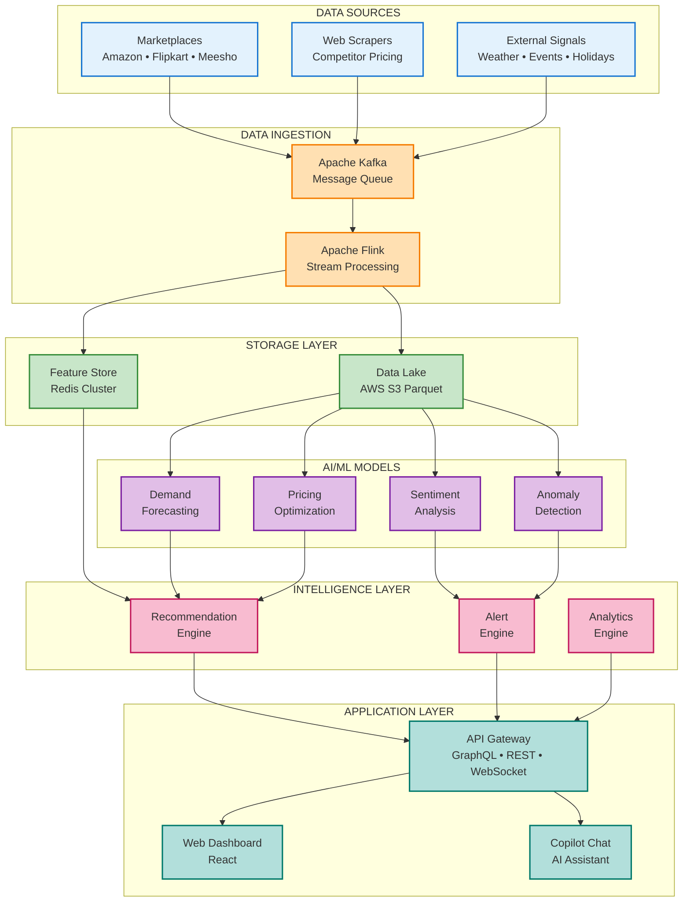
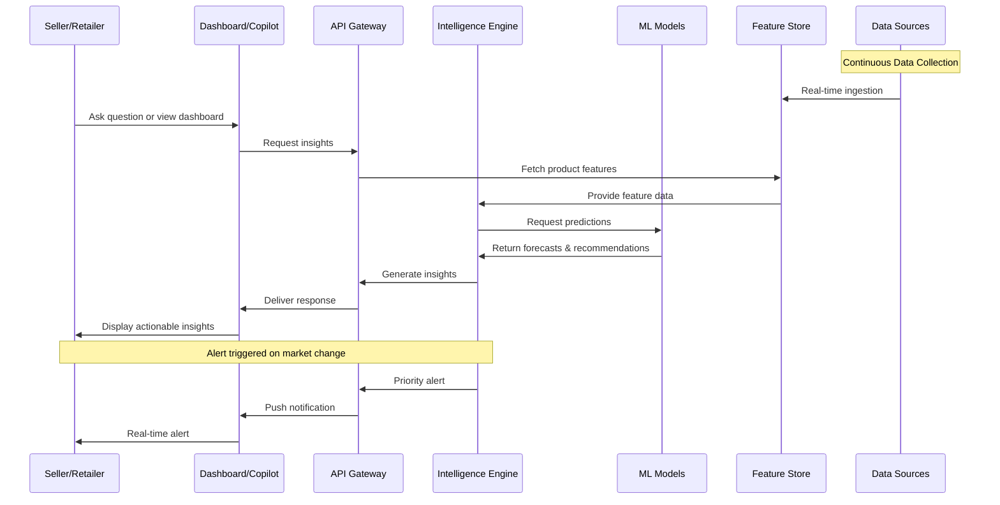

# Updated Diagram Prompts for ShelfIQ Presentation

## MERMAID DIAGRAMS - RECOMMENDED FOR HACKATHON

Mermaid diagrams are EXCELLENT for hackathons because they:
- Are code-based and version-controllable
- Render consistently across platforms
- Can be easily updated and iterated
- Show technical competency
- Export cleanly to PNG/SVG for PowerPoint

### RECOMMENDED MERMAID DIAGRAMS:

---

## DIAGRAM 1: HIGH-LEVEL ARCHITECTURE (Slide 5) - MERMAID ✅

**Best for:** System overview, component relationships



**Export Instructions:**
1. Use Mermaid Live Editor (mermaid.live)
2. Set width to 1600px for landscape PowerPoint
3. Export as PNG with transparent background
4. Insert into PowerPoint slide

---

## DIAGRAM 2: DATA FLOW SEQUENCE (Slide 5) - MERMAID ✅

**Best for:** Showing step-by-step process flow



**Export Instructions:**
1. Mermaid Live Editor
2. Width: 1400px for landscape
3. PNG export with white background

---

## DIAGRAM 3: COMPONENT INTERACTION (Alternative for Slide 5) - MERMAID ✅

```mermaid
flowchart LR
    subgraph input["INPUT"]
        direction TB
        M[Marketplace Data]
        C[Competitor Prices]
        E[External Signals]
    end

    subgraph process["PROCESSING"]
        direction TB
        I[Ingestion Pipeline]
        V[Validation & Cleansing]
        F[Feature Engineering]
    end

    subgraph intelligence["AI INTELLIGENCE"]
        direction TB
        D[Demand Forecasting]
        P[Pricing Optimization]
        S[Sentiment Analysis]
        A[Anomaly Detection]
    end

    subgraph output["OUTPUT"]
        direction TB
        R[Recommendations]
        AL[Alerts]
        AN[Analytics]
    end

    subgraph user["USER INTERFACE"]
        direction TB
        DA[Dashboard]
        CH[Copilot Chat]
    end

    input --> process
    process --> intelligence
    intelligence --> output
    output --> user

    style input fill:#E3F2FD,stroke:#1976D2,stroke-width:3px
    style process fill:#FFE0B2,stroke:#F57C00,stroke-width:3px
    style intelligence fill:#E1BEE7,stroke:#7B1FA2,stroke-width:3px
    style output fill:#F8BBD0,stroke:#C2185B,stroke-width:3px
    style user fill:#B2DFDB,stroke:#00796B,stroke-width:3px
```



---

## CHATGPT/DALL-E PROMPTS - OPTIMIZED FOR LANDSCAPE PPT

### PROMPT 1: DASHBOARD WIREFRAME (Slide 6)

```
Create a professional web dashboard wireframe mockup in LANDSCAPE orientation (16:9 aspect ratio, 1920x1080px).

LAYOUT - HORIZONTAL OPTIMIZATION:

TOP NAVIGATION BAR (spanning full width):
- Left: "ShelfIQ" logo
- Center: Search bar
- Right: Notification bell, Profile icon, Settings

MAIN CONTENT (utilize full horizontal space):

LEFT SECTION (60% width):
- KPI Cards Row: 4 cards showing Revenue, Margin, Market Share, Active Alerts
- Large Chart: Revenue trend line chart with clean axes
- Use horizontal space efficiently

RIGHT SECTION (40% width):
- Top Opportunities panel (3 items with icons)
- Recent Alerts panel (3 items with status indicators)

DESIGN REQUIREMENTS:
- 16:9 landscape aspect ratio
- Maximize horizontal space usage
- Clean, minimal design
- Light background with white cards
- Use Material Design principles
- Professional SaaS aesthetic
- No text smaller than readable size
- Clear visual hierarchy

COLOR PALETTE:
- Primary: Blue #1976D2
- Success: Green #4CAF50
- Warning: Orange #FF9800
- Error: Red #F44336
- Background: Light gray #F5F5F5
- Cards: White #FFFFFF

OUTPUT: PNG, 1920x1080px, landscape orientation, suitable for PowerPoint slide
```

---

### PROMPT 2: PRODUCT DETAIL WIREFRAME (Slide 6)

```
Create a product detail page wireframe in LANDSCAPE orientation (16:9 aspect ratio, 1920x1080px).

LAYOUT - HORIZONTAL SPLIT:

LEFT COLUMN (65% width):
- Product header with back button
- Large price history chart (multi-line graph)
- AI Recommendation card (highlighted with gradient)
  • Show price recommendation
  • Impact metrics in 3 columns
  • Action buttons

RIGHT COLUMN (35% width):
- Demand forecast mini-chart
- Competitor analysis stats
- Quick actions panel

DESIGN REQUIREMENTS:
- 16:9 landscape format
- Efficient use of horizontal space
- Data-rich but not cluttered
- Professional charts and graphs
- Clear call-to-action buttons
- Consistent spacing

STYLE:
- Modern SaaS design
- White cards with shadows
- Blue accent color for primary actions
- Clean typography
- Icons for visual interest

OUTPUT: PNG, 1920x1080px, landscape, PowerPoint-ready
```

---

### PROMPT 3: COPILOT CHAT INTERFACE (Slide 6)

```
Create a modern AI chat interface in LANDSCAPE orientation (16:9 aspect ratio, 1920x1080px).

LAYOUT - SIDE PANEL DESIGN:

MAIN AREA (70% width):
- Dashboard or product view in background (blurred)

CHAT PANEL (30% width, right side):
- Header: "ShelfIQ Copilot" with AI icon
- Chat messages:
  • User message (right-aligned, blue bubble)
  • AI response (left-aligned, white bubble with embedded cards)
  • Show rich content: cards with recommendations, action buttons
- Input field at bottom with send button

CHAT CONTENT:
- User: "Which products should I focus on this week?"
- AI: Response with 3 priority cards showing:
  • Product name and SKU
  • Issue or opportunity
  • Recommended action
  • Expected impact
  • Action button

DESIGN REQUIREMENTS:
- 16:9 landscape format
- Chat panel overlays main interface
- Modern chat UI (ChatGPT-style)
- Rich content in messages (cards, buttons)
- Clean, readable fonts
- Smooth rounded corners

STYLE:
- User messages: Blue background
- AI messages: White with border
- Embedded cards: Light gray background
- Professional, modern aesthetic

OUTPUT: PNG, 1920x1080px, landscape, PowerPoint-ready
```

---

### PROMPT 4: SYSTEM ARCHITECTURE INFOGRAPHIC (Slide 5)

```
Create a modern system architecture infographic in LANDSCAPE orientation (16:9 aspect ratio, 1920x1080px).

LAYOUT - HORIZONTAL FLOW (Left to Right):

COLUMN 1 - DATA SOURCES:
- 3 stacked boxes:
  • Marketplaces (with logos)
  • Web Scrapers
  • External Signals
- Color: Light blue

COLUMN 2 - INGESTION:
- 2 boxes:
  • Kafka
  • Flink
- Color: Orange
- Arrows from Column 1

COLUMN 3 - STORAGE:
- 2 boxes:
  • Feature Store (Redis)
  • Data Lake (S3)
- Color: Green
- Arrows from Column 2

COLUMN 4 - AI/ML:
- 4 boxes in 2x2 grid:
  • Demand Forecasting
  • Pricing Optimization
  • Sentiment Analysis
  • Anomaly Detection
- Color: Purple
- Arrows from Column 3

COLUMN 5 - INTELLIGENCE:
- 3 stacked boxes:
  • Recommendation Engine
  • Alert Engine
  • Analytics Engine
- Color: Pink
- Arrows from Column 4

COLUMN 6 - USER INTERFACE:
- 2 boxes:
  • Web Dashboard
  • Copilot Chat
- Color: Teal
- Arrows from Column 5

DESIGN REQUIREMENTS:
- 16:9 landscape format
- Horizontal flow maximizes space
- Rounded rectangles for all boxes
- Icons inside each box
- Flowing arrows between columns
- Clean, professional infographic style
- AWS color scheme where applicable

STYLE:
- Modern, flat design
- Subtle shadows for depth
- White background
- Consistent spacing
- Professional tech aesthetic

OUTPUT: PNG, 1920x1080px, landscape, PowerPoint-ready
```

---

## RECOMMENDED APPROACH FOR HACKATHON:

### Use Mermaid for:
1. ✅ **System Architecture** (Slide 5) - Shows technical depth
2. ✅ **Data Flow Sequence** (Slide 5) - Clear process visualization
3. ✅ **Component Interaction** (Slide 5) - Easy to understand

### Use ChatGPT/DALL-E for:
1. **Dashboard Wireframes** (Slide 6) - Better UI mockups
2. **Product Detail Page** (Slide 6) - Rich interface details
3. **Copilot Chat Interface** (Slide 6) - Modern chat UI

### Use PowerPoint SmartArt for:
1. **Simple Process Flows** - Quick and editable
2. **Comparison Tables** - Built-in templates
3. **Timeline Diagrams** - Easy to customize

---

## MERMAID EXPORT GUIDE:

### Step-by-Step:
1. Go to https://mermaid.live
2. Paste the Mermaid code
3. Click "Actions" → "PNG"
4. Set width to **1600px** (for landscape)
5. Download PNG
6. Insert into PowerPoint
7. Resize to fit slide (maintain aspect ratio)

### Pro Tips:
- Use transparent background for flexibility
- Export at 2x resolution for crisp display
- Test on actual PowerPoint slide before finalizing
- Keep consistent styling across all diagrams

---

## POWERPOINT OPTIMIZATION:

### Slide Dimensions:
- Standard: 10" x 7.5" (4:3)
- Widescreen: 13.33" x 7.5" (16:9) ← **Use this**

### Image Specifications:
- Resolution: 1920x1080px minimum
- Format: PNG with transparency
- DPI: 150-300 for crisp display
- File size: Under 2MB per image

### Layout Tips:
1. Leave 0.5" margin on all sides
2. Use 2/3 of slide for diagram, 1/3 for text
3. Align diagrams to grid
4. Consistent sizing across slides
5. Use slide master for consistency

---

## QUICK REFERENCE:

| Diagram Type | Best Tool | Slide | Aspect Ratio |
|--------------|-----------|-------|--------------|
| System Architecture | Mermaid | 5 | 16:9 landscape |
| Data Flow | Mermaid | 5 | 16:9 landscape |
| Dashboard Wireframe | ChatGPT | 6 | 16:9 landscape |
| Product Detail | ChatGPT | 6 | 16:9 landscape |
| Chat Interface | ChatGPT | 6 | 16:9 landscape |
| Process Flow | PowerPoint SmartArt | 5 | Native |

---

## FINAL CHECKLIST:

Before adding to PowerPoint:
- [ ] Correct aspect ratio (16:9)
- [ ] High resolution (1920x1080px minimum)
- [ ] Readable text size
- [ ] Consistent color scheme
- [ ] Professional appearance
- [ ] No unnecessary numbers or metrics
- [ ] Clear visual hierarchy
- [ ] Proper spacing and alignment
- [ ] Tested on actual slide
- [ ] File size optimized

