# ShelfIQ Hackathon Presentation - Final Diagram Mapping

## Your Slide Structure with Diagram Recommendations

---

## SLIDE 4: List of Features Offered by the Solution
**Content:** 10 core features with descriptions
**Diagram:** ❌ No diagram needed
**Presentation:** Use bullet points with icons for each feature

---

## SLIDE 5: Process Flow Diagram or Use-Case Diagram
**Diagram Required:** ✅ YES

### RECOMMENDED: Use Case Flow (Sequence Diagram)
**Use:** Diagram 3 - Use Case Flow
**Why:** Shows real user interaction and system response
**Best for:** Demonstrating how a seller uses ShelfIQ in real scenario


**Export:** Mermaid Live Editor → 1400x600px PNG

### ALTERNATIVE: Process Flow (Data Flow)
**Use:** Diagram 2 - Data Flow (Simplified Sequential)
**Why:** Shows end-to-end data processing flow
**Best for:** Technical audience wanting to see data pipeline

```mermaid
%%{init: {'theme':'base', 'themeVariables': { 'primaryColor':'#fff','primaryBorderColor':'#1976D2','lineColor':'#1976D2','fontSize':'14px'}}}%%
graph LR
    A[Data Collection<br/>Marketplaces & Scrapers] -->|Real-time| B[Processing<br/>Kafka + Flink]
    B -->|Validated| C[Storage<br/>Feature Store + Data Lake]
    C -->|Features| D[AI Models<br/>Forecast • Pricing • Sentiment]
    D -->|Insights| E[Intelligence<br/>Recommendations + Alerts]
    E -->|Delivery| F[User Interface<br/>Dashboard + Copilot]

    style A fill:#E3F2FD,stroke:#1976D2,stroke-width:2px
    style B fill:#FFE0B2,stroke:#F57C00,stroke-width:2px
    style C fill:#C8E6C9,stroke:#388E3C,stroke-width:2px
    style D fill:#E1BEE7,stroke:#7B1FA2,stroke-width:2px
    style E fill:#F8BBD0,stroke:#C2185B,stroke-width:2px
    style F fill:#B2DFDB,stroke:#00796B,stroke-width:2px
```



**Export:** Mermaid Live Editor → 1600x400px PNG

**MY RECOMMENDATION:** Use the **Use Case Flow (Diagram 3)** - it's more engaging and shows practical application!

---

## SLIDE 6: Wireframes/Mock Diagrams (Optional)
**Diagram Required:** ✅ YES (highly recommended even though optional)

### OPTION A: Dashboard Wireframe (RECOMMENDED)
**Use:** Diagram 5 - Dashboard Wireframe
**Why:** Shows the main interface with all key features visible
**Best for:** Giving judges a complete view of the product

**ChatGPT/DALL-E Prompt:**
```
Create a clean web dashboard wireframe in LANDSCAPE format (1600x800px) that fits below a presentation title.

COMPACT LAYOUT - MAXIMIZE HORIZONTAL SPACE:

TOP BAR (thin, 60px height):
- Left: "ShelfIQ" logo (small)
- Center: Search bar (compact)
- Right: Bell icon, Profile icon

MAIN CONTENT (use full width efficiently):

LEFT SECTION (65% width):
- 4 KPI CARDS in a row (compact, equal width):
  • Revenue: ₹2.4L (green up arrow)
  • Margin: 18.5% (red down arrow)
  • Market Share: 23.4% (green up arrow)
  • Alerts: 15 (red badge)

- LARGE CHART (below KPIs):
  • Title: "Revenue Trend"
  • Simple line chart trending upward
  • Clean axes, minimal labels

RIGHT SECTION (35% width):
- TOP PANEL: "Top Opportunities" (3 items with icons)
  • Increase price on SKU-1234
  • Optimize listing for SKU-5678
  • Restock SKU-9012

- BOTTOM PANEL: "Recent Alerts" (3 items with colored dots)
  • 🔴 Competitor price drop
  • 🟡 Demand spike detected
  • 🟢 Margin improved

DESIGN CONSTRAINTS:
- Total height: 800px (fits below title in slide)
- Width: 1600px (landscape)
- Minimal padding and margins
- Clean, professional SaaS design
- Light gray background (#F5F5F5)
- White cards with subtle shadows
- Blue accent color (#1976D2)
- Readable fonts (minimum 12pt equivalent)

STYLE:
- Modern, flat design
- Material Design principles
- No unnecessary decorations
- Focus on data and clarity
- Professional business aesthetic

OUTPUT: PNG, 1600x800px, landscape, PowerPoint-ready
```

### OPTION B: Copilot Chat Interface (ALTERNATIVE)
**Use:** Diagram 7 - Copilot Chat Interface
**Why:** Highlights the unique AI copilot feature (your USP!)
**Best for:** Emphasizing AI innovation

**ChatGPT/DALL-E Prompt:**
```
Create an AI copilot chat interface in LANDSCAPE format (1600x800px) for presentation slide.

LAYOUT - SIDE PANEL OVERLAY:

BACKGROUND (70% width, left side):
- Blurred dashboard view (subtle)

CHAT PANEL (30% width, right side, 800px height):
- HEADER (40px):
  • "💬 ShelfIQ Copilot"
  • Minimize and close icons

- CHAT AREA (scrollable):

  USER MESSAGE (right-aligned, blue bubble):
  "Which products should I focus on this week?"

  AI RESPONSE (left-aligned, white bubble):
  "Here are your top 3 priorities:"

  EMBEDDED CARD 1:
  "1. SKU-1234 (Wireless Headphones)"
  • Issue: Competitor dropped price by 8%
  • Action: Match price or improve listing
  • Impact: Protect revenue
  [View Details] button

  EMBEDDED CARD 2:
  "2. SKU-5678 (Smart Watch)"
  • Opportunity: Demand spike detected
  • Action: Increase price
  • Impact: Additional margin
  [Apply] button

  EMBEDDED CARD 3:
  "3. SKU-9012 (Bluetooth Speaker)"
  • Alert: Low stock
  • Action: Reorder units
  • Risk: Potential stockout
  [Create PO] button

- INPUT AREA (bottom, 60px):
  • Text field: "Type your question..."
  • Send button (paper plane icon)

DESIGN CONSTRAINTS:
- Height: 800px (fits slide)
- Width: 1600px total (chat panel 480px)
- Modern chat UI (ChatGPT-style)
- Rich content in messages
- Clean, readable design

STYLE:
- User messages: Blue (#1976D2)
- AI messages: White with border
- Embedded cards: Light gray (#F5F5F5)
- Rounded corners throughout
- Professional, modern aesthetic

OUTPUT: PNG, 1600x800px, landscape, PowerPoint-ready
```

**MY RECOMMENDATION:** Use **Dashboard Wireframe (Diagram 5)** - it's more comprehensive and shows the complete product!

---

## SLIDE 7: Architecture Diagram
**Diagram Required:** ✅ YES

### RECOMMENDED: System Architecture (Horizontal Flow)
**Use:** Diagram 1 - System Architecture
**Why:** Clean, easy to understand, shows complete system
**Best for:** Technical judges and demonstrating system design

```mermaid
%%{init: {'theme':'base', 'themeVariables': { 'primaryColor':'#E3F2FD','primaryTextColor':'#1565C0','primaryBorderColor':'#1976D2','lineColor':'#1976D2','secondaryColor':'#FFE0B2','tertiaryColor':'#C8E6C9'}}}%%
flowchart LR
    subgraph DS[" DATA SOURCES "]
        M[Marketplaces<br/>Amazon • Flipkart]
        W[Web Scrapers]
        E[External Signals]
    end

    subgraph DP[" DATA PIPELINE "]
        K[Kafka]
        F[Flink]
    end

    subgraph ST[" STORAGE "]
        R[Redis<br/>Feature Store]
        S[S3<br/>Data Lake]
    end

    subgraph AI[" AI/ML LAYER "]
        D[Demand<br/>Forecast]
        P[Pricing<br/>Engine]
        A[Sentiment<br/>Analysis]
    end

    subgraph UI[" USER INTERFACE "]
        API[API Layer]
        DASH[Dashboard]
        CHAT[Copilot]
    end

    DS --> DP
    DP --> ST
    ST --> AI
    AI --> UI

    style DS fill:#E3F2FD,stroke:#1976D2,stroke-width:2px
    style DP fill:#FFE0B2,stroke:#F57C00,stroke-width:2px
    style ST fill:#C8E6C9,stroke:#388E3C,stroke-width:2px
    style AI fill:#E1BEE7,stroke:#7B1FA2,stroke-width:2px
    style UI fill:#B2DFDB,stroke:#00796B,stroke-width:2px
```



**Export:** Mermaid Live Editor → 1400x600px PNG

**This is the BEST architecture diagram for your presentation!**

---

## SLIDE 8: Technologies to be Used in the Solution
**Diagram Required:** ✅ YES (highly recommended)

### RECOMMENDED: Tech Stack with AWS Emphasis
**Use:** Diagram 4 - AI/ML Pipeline (Technology Stack)
**Why:** Shows all technologies organized by layer
**Best for:** Demonstrating technical depth and AWS integration


**Export:** Mermaid Live Editor → 1400x700px PNG

**This diagram is PERFECT for showing your tech stack!**

---

## SLIDE 9: Estimated Implementation Cost (Optional)
**Diagram Required:** ❌ No diagram needed
**Presentation:** Use tables or simple bar charts in PowerPoint

---

## SLIDE 10: Add as per Requirements for the Hackathon
**Diagram Required:** ✅ YES (CRITICAL for AWS Hackathon!)

### MUST USE: AWS Services Integration
**Use:** Diagram 10 - AWS Services Integration
**Why:** Shows deep AWS integration (judges want to see this!)
**Best for:** Demonstrating AWS service usage and cloud-native architecture


**Export:** Mermaid Live Editor → 1400x700px PNG

**This is ESSENTIAL for the AWS hackathon - shows you're using AWS extensively!**

---

## FINAL RECOMMENDATIONS FOR YOUR PRESENTATION

### Slide 5: Process Flow / Use Case
**BEST CHOICE:** Diagram 3 - Use Case Flow (Sequence Diagram)
- **Why:** More engaging, shows practical application
- **Tool:** Mermaid
- **Time:** 5 minutes to generate

### Slide 6: Wireframes/Mockups
**BEST CHOICE:** Diagram 5 - Dashboard Wireframe
- **Why:** Comprehensive view of the product interface
- **Tool:** ChatGPT/DALL-E
- **Time:** 10-15 minutes to generate and refine

**ALTERNATIVE:** Diagram 7 - Copilot Chat (if you want to emphasize AI)

### Slide 7: Architecture
**BEST CHOICE:** Diagram 1 - System Architecture (Horizontal Flow)
- **Why:** Clean, professional, easy to understand
- **Tool:** Mermaid
- **Time:** 5 minutes to generate

### Slide 8: Technologies
**BEST CHOICE:** Diagram 4 - Tech Stack
- **Why:** Shows all technologies organized by layer
- **Tool:** Mermaid
- **Time:** 5 minutes to generate

### Slide 10: Hackathon Requirements
**MUST USE:** Diagram 10 - AWS Services Integration
- **Why:** Critical for AWS hackathon judges
- **Tool:** Mermaid
- **Time:** 5 minutes to generate

---

## QUICK GENERATION GUIDE

### Step 1: Generate Mermaid Diagrams (30 minutes total)
1. Go to https://mermaid.live
2. Copy Diagram 3 code → Export as PNG (1400x600px) → Save for Slide 5
3. Copy Diagram 1 code → Export as PNG (1400x600px) → Save for Slide 7
4. Copy Diagram 4 code → Export as PNG (1400x700px) → Save for Slide 8
5. Copy Diagram 10 code → Export as PNG (1400x700px) → Save for Slide 10

### Step 2: Generate Dashboard Wireframe (15 minutes)
1. Open ChatGPT (GPT-4 with DALL-E)
2. Copy Diagram 5 prompt
3. Paste and generate
4. Download PNG → Save for Slide 6

### Step 3: Insert into PowerPoint (15 minutes)
1. Open your presentation
2. Insert each PNG into corresponding slide
3. Position below title
4. Center align
5. Resize if needed (maintain aspect ratio)

**Total Time: ~60 minutes for all 5 diagrams**

---

## SUMMARY TABLE

| Slide | Title | Diagram | Tool | Dimensions | Priority |
|-------|-------|---------|------|------------|----------|
| 4 | Features | ❌ None | - | - | - |
| 5 | Process Flow | ✅ Diagram 3 | Mermaid | 1400x600 | HIGH |
| 6 | Wireframes | ✅ Diagram 5 | ChatGPT | 1600x800 | HIGH |
| 7 | Architecture | ✅ Diagram 1 | Mermaid | 1400x600 | CRITICAL |
| 8 | Technologies | ✅ Diagram 4 | Mermaid | 1400x700 | HIGH |
| 9 | Cost | ❌ None | - | - | - |
| 10 | AWS/Hackathon | ✅ Diagram 10 | Mermaid | 1400x700 | CRITICAL |

---

## FINAL CHECKLIST

Before your presentation:
- [ ] Slide 5: Use Case Flow diagram inserted
- [ ] Slide 6: Dashboard Wireframe inserted
- [ ] Slide 7: System Architecture diagram inserted
- [ ] Slide 8: Tech Stack diagram inserted
- [ ] Slide 10: AWS Services diagram inserted
- [ ] All diagrams are readable on screen
- [ ] All diagrams fit properly below titles
- [ ] Colors are consistent across diagrams
- [ ] File sizes are reasonable (<2MB each)
- [ ] Tested presentation on actual display

**You're ready to impress the judges! 🚀**

