# ShelfIQ - Enhanced Architecture Diagram
## Detailed yet compact - fits perfectly in PowerPoint slide

---

## SLIDE 7: ENHANCED ARCHITECTURE - PRODUCTION GRADE

### Option 1: Two-Row Architecture (RECOMMENDED)

**Export Settings:**
- Tool: mermaid.live
- Width: 1400px
- Height: Auto (will be ~500px)
- Background: Transparent

---

### Option 2: Three-Column Architecture (ALTERNATIVE)

**Export Settings:**
- Width: 1400px
- Height: Auto (~450px)

---

### Option 3: Layered Architecture with Details (MOST DETAILED)

```mermaid
%%{init: {'theme':'base', 'themeVariables': {'fontSize':'12px'}}}%%
graph TB
    subgraph Layer1[" 🌐 EDGE & CDN LAYER "]
        direction LR
        CF[CloudFront<br/>Global CDN<br/>Edge Caching]
        R53[Route 53<br/>DNS<br/>Routing]
        AG[API Gateway<br/>REST + WebSocket<br/>Rate Limiting]
    end

    subgraph Layer2[" 🖥️ COMPUTE LAYER - Amazon EKS "]
        direction LR
        K8S[Kubernetes<br/>Auto-scaling<br/>Load Balancing]
        API[API Service<br/>GraphQL<br/>Business Logic]
        COPILOT[Copilot Service<br/>AI Chat<br/>NLP]
        ALERT[Alert Service<br/>Notifications<br/>Priority Queue]
    end

    subgraph Layer3[" 🤖 AI/ML LAYER "]
        direction LR
        SM[SageMaker<br/>Demand Forecast<br/>Pricing Models]
        BR[Bedrock<br/>Foundation Models<br/>LLM Integration]
        ML[ML Pipeline<br/>Training<br/>Deployment]
    end

    subgraph Layer4[" 💾 DATA LAYER "]
        direction LR
        RDS[(RDS PostgreSQL<br/>Transactional<br/>ACID)]
        REDIS[(ElastiCache Redis<br/>Feature Store<br/>Sub-ms Latency)]
        S3[(S3 Data Lake<br/>Parquet Files<br/>Historical Data)]
    end

    subgraph Layer5[" ⚙️ DATA PIPELINE "]
        direction LR
        KAFKA[Kafka<br/>Event Streaming<br/>Real-time]
        GLUE[Glue<br/>ETL Jobs<br/>Data Catalog]
        FLINK[Flink<br/>Stream Processing<br/>Validation]
    end

    subgraph Layer6[" 📡 DATA SOURCES "]
        direction LR
        FLIP[Flipkart API]
        MEESHO[Meesho API]
        AMZ[Amazon.in API]
        SCRAPE[Web Scrapers]
    end

    Layer1 --> Layer2
    Layer2 --> Layer3
    Layer2 --> Layer4
    Layer3 --> Layer4
    Layer4 --> Layer5
    Layer5 --> Layer6

    style Layer1 fill:#E3F2FD,stroke:#1976D2,stroke-width:2px
    style Layer2 fill:#FFE0B2,stroke:#FF9900,stroke-width:2px
    style Layer3 fill:#FFE0B2,stroke:#FF9900,stroke-width:2px
    style Layer4 fill:#FFE0B2,stroke:#FF9900,stroke-width:2px
    style Layer5 fill:#C8E6C9,stroke:#388E3C,stroke-width:2px
    style Layer6 fill:#E1BEE7,stroke:#7B1FA2,stroke-width:2px
```

**Export Settings:**
- Width: 1300px
- Height: Auto (~550px)
- Most detailed option

---

### Option 4: Hybrid Layout - Detailed but Compact (BEST BALANCE)

```mermaid
%%{init: {'theme':'base', 'themeVariables': {'fontSize':'13px'}}}%%
graph TB
    subgraph Top[" 🌐 EDGE LAYER "]
        direction LR
        U[Users] --> CF[CloudFront CDN]
        CF --> AG[API Gateway<br/>REST + WebSocket]
    end

    subgraph Middle[" 🖥️ APPLICATION LAYER "]
        direction LR

        subgraph EKS[" Amazon EKS Cluster "]
            direction TB
            K8S[Kubernetes<br/>Orchestration]
            SVC1[API Service<br/>GraphQL]
            SVC2[Copilot Service<br/>AI Chat]
            SVC3[Alert Service<br/>Notifications]
            K8S --> SVC1
            K8S --> SVC2
            K8S --> SVC3
        end

        subgraph AI[" AI/ML Services "]
            direction TB
            SM[SageMaker<br/>ML Training<br/>Deployment]
            BR[Bedrock<br/>Foundation<br/>Models]
        end
    end

    subgraph Bottom[" 💾 DATA & STORAGE "]
        direction LR

        subgraph DB[" Databases "]
            direction TB
            RDS[(RDS<br/>PostgreSQL)]
            REDIS[(ElastiCache<br/>Redis)]
        end

        subgraph Lake[" Data Lake "]
            direction TB
            S3[(S3<br/>Parquet)]
            GLUE[Glue<br/>ETL]
        end

        subgraph Stream[" Streaming "]
            direction TB
            KAFKA[Kafka<br/>Events]
            FLINK[Flink<br/>Processing]
        end
    end

    subgraph Sources[" 📡 DATA SOURCES "]
        direction LR
        MKT[Marketplaces<br/>Flipkart • Meesho • Amazon.in]
        SCRAPE[Web Scrapers<br/>Competitor Data]
    end

    Top --> Middle
    Middle --> Bottom
    Bottom --> Sources

    style Top fill:#E3F2FD,stroke:#1976D2,stroke-width:2px
    style Middle fill:#FFE0B2,stroke:#FF9900,stroke-width:3px
    style Bottom fill:#C8E6C9,stroke:#388E3C,stroke-width:2px
    style Sources fill:#E1BEE7,stroke:#7B1FA2,stroke-width:2px
    style EKS fill:#FFE0B2,stroke:#FF9900,stroke-width:2px
    style AI fill:#FFE0B2,stroke:#FF9900,stroke-width:2px
    style DB fill:#C8E6C9,stroke:#388E3C,stroke-width:1px
    style Lake fill:#C8E6C9,stroke:#388E3C,stroke-width:1px
    style Stream fill:#C8E6C9,stroke:#388E3C,stroke-width:1px
```

**Export Settings:**
- Width: 1400px
- Height: Auto (~500px)
- **RECOMMENDED** - Best balance of detail and compactness

---

## COMPARISON TABLE

| Option | Detail Level | Height | Best For |
|--------|-------------|--------|----------|
| Option 1 | Medium | ~500px | Clear flow, easy to explain |
| Option 2 | Medium | ~450px | Column-based thinking |
| Option 3 | High | ~550px | Technical audience |
| Option 4 | High | ~500px | **BEST BALANCE** ⭐ |

---

## RECOMMENDED: OPTION 4 - HYBRID LAYOUT

**Why this is the best:**
- Shows all major AWS services
- Groups related components (EKS cluster, databases, streaming)
- Clear data flow from users to sources
- Fits in slide (~500px height)
- Professional and detailed
- Easy to explain in 2-3 minutes

**What it shows:**
1. **Edge Layer:** CloudFront CDN, API Gateway
2. **Application Layer:**
   - EKS with 3 microservices
   - SageMaker for ML
   - Bedrock for LLM
3. **Data & Storage:**
   - Databases (RDS, Redis)
   - Data Lake (S3, Glue)
   - Streaming (Kafka, Flink)
4. **Data Sources:** Marketplaces and scrapers

---

## EXPORT INSTRUCTIONS

### Step-by-Step:
1. Go to https://mermaid.live
2. Clear existing code
3. Copy **Option 4** code (recommended)
4. Paste into editor
5. Wait for preview to render
6. Click "Actions" → "PNG"
7. Settings:
   - Width: 1400px
   - Background: Transparent
8. Download PNG
9. Save as "slide7_architecture.png"

### Insert into PowerPoint:
1. Open slide 7
2. Insert → Pictures → select PNG
3. Position below title
4. Center horizontally
5. Resize if needed (hold Shift)
6. Should fit perfectly with ~100px margins

---

## IF STILL TOO LARGE

### Reduce to Option 1 (Two-Row):
- Simpler but still shows key components
- Height: ~500px
- Faster to explain

### Or use this ULTRA-COMPACT version:

**Export:** 1400px width, ~250px height

---

## TECHNICAL DETAILS SHOWN

### Option 4 (Recommended) includes:
- ✅ CloudFront CDN for global delivery
- ✅ API Gateway for REST + WebSocket
- ✅ Amazon EKS with Kubernetes orchestration
- ✅ 3 Microservices (API, Copilot, Alert)
- ✅ SageMaker for ML training and deployment
- ✅ Bedrock for foundation models
- ✅ RDS PostgreSQL for transactional data
- ✅ ElastiCache Redis for caching
- ✅ S3 for data lake
- ✅ Glue for ETL
- ✅ Kafka for event streaming
- ✅ Flink for stream processing
- ✅ Marketplace integrations
- ✅ Web scrapers

**This is production-grade architecture that will impress judges!**

---

## FINAL CHECKLIST

- [ ] Option 4 code copied
- [ ] Exported from mermaid.live at 1400px width
- [ ] PNG downloaded
- [ ] Inserted into PowerPoint slide 7
- [ ] Positioned below title
- [ ] Centered horizontally
- [ ] Text is readable
- [ ] Fits with proper margins
- [ ] All AWS services visible
- [ ] Data flow is clear

**You now have an enhanced, production-grade architecture diagram that fits perfectly! 🚀**

