# ShelfIQ Diagrams - Ultra-Compact for PowerPoint Slides
## Designed to fit perfectly below slide titles

---

## SLIDE 5: PROCESS FLOW - COMPACT HORIZONTAL

```mermaid
%%{init: {'theme':'base', 'themeVariables': {'fontSize':'15px'}}}%%
graph LR
    A[📥 Collect<br/>Marketplaces<br/>Competitors] --> B[⚙️ Process<br/>Kafka<br/>Flink]
    B --> C[🤖 AI Models<br/>Forecast<br/>Pricing]
    C --> D[💡 Insights<br/>Alerts<br/>Actions]
    D --> E[🖥️ Deliver<br/>Dashboard<br/>Copilot]

    style A fill:#E3F2FD,stroke:#1976D2,stroke-width:3px
    style B fill:#FFE0B2,stroke:#F57C00,stroke-width:3px
    style C fill:#E1BEE7,stroke:#7B1FA2,stroke-width:3px
    style D fill:#F8BBD0,stroke:#C2185B,stroke-width:3px
    style E fill:#B2DFDB,stroke:#00796B,stroke-width:3px
```



**Export:** mermaid.live → Width: 1400px, Height: 250px

---

## SLIDE 6: DASHBOARD WIREFRAME - COMPACT

**ChatGPT Prompt:**
```
Create a minimal dashboard wireframe, landscape 1600x600px.

LAYOUT:
- Top bar (40px): Logo | Search | Icons
- 4 KPI cards in row (80px height): Revenue | Margin | Share | Alerts
- Main area split 70/30:
  Left: Simple line chart
  Right: 2 small panels (Opportunities, Alerts)

STYLE: Minimal, clean, light gray background, blue accents
OUTPUT: PNG 1600x600px
```

---

## SLIDE 7: ARCHITECTURE - ULTRA COMPACT

```mermaid
%%{init: {'theme':'base', 'themeVariables': {'fontSize':'14px'}}}%%
graph LR
    A[📱 Users] --> B[🌐 CloudFront<br/>API Gateway]
    B --> C[🖥️ EKS<br/>Kubernetes]
    C --> D[🤖 SageMaker<br/>Bedrock]
    C --> E[💾 RDS<br/>Redis<br/>S3]

    style A fill:#E3F2FD,stroke:#1976D2,stroke-width:2px
    style B fill:#FFE0B2,stroke:#FF9900,stroke-width:3px
    style C fill:#FFE0B2,stroke:#FF9900,stroke-width:3px
    style D fill:#FFE0B2,stroke:#FF9900,stroke-width:3px
    style E fill:#FFE0B2,stroke:#FF9900,stroke-width:3px
```



**Export:** mermaid.live → Width: 1400px, Height: 250px

---

## SLIDE 8: TECH STACK - COMPACT

```mermaid
%%{init: {'theme':'base', 'themeVariables': {'fontSize':'14px'}}}%%
graph TB
    A[🎨 Frontend<br/>React + TypeScript + MUI] --> B[🔌 API<br/>GraphQL + FastAPI + WebSocket]
    B --> C[🧠 AI/ML<br/>Prophet + LightGBM + DistilBERT + GPT-4]
    C --> D[💾 Data<br/>Kafka + Flink + Redis + PostgreSQL]
    D --> E[☁️ AWS<br/>EKS + SageMaker + Bedrock + S3]

    style A fill:#B2DFDB,stroke:#00796B,stroke-width:2px
    style B fill:#E1BEE7,stroke:#7B1FA2,stroke-width:2px
    style C fill:#F8BBD0,stroke:#C2185B,stroke-width:2px
    style D fill:#C8E6C9,stroke:#388E3C,stroke-width:2px
    style E fill:#FFE0B2,stroke:#FF9900,stroke-width:3px
```



**Export:** mermaid.live → Width: 1000px, Height: 400px

---

## SLIDE 9: COST - ULTRA COMPACT

```mermaid
%%{init: {'theme':'base', 'themeVariables': {'fontSize':'15px'}}}%%
graph LR
    A[💰 Cost] --> B[👥 Team<br/>Dev + ML<br/>DevOps]
    A --> C[☁️ Infra<br/>AWS<br/>Services]
    A --> D[🔌 APIs<br/>AI/ML<br/>Data]
    A --> E[📊 Ops<br/>Security<br/>Marketing]

    style A fill:#1976D2,stroke:#0D47A1,stroke-width:3px,color:#fff
    style B fill:#E3F2FD,stroke:#1976D2,stroke-width:2px
    style C fill:#FFE0B2,stroke:#F57C00,stroke-width:2px
    style D fill:#E1BEE7,stroke:#7B1FA2,stroke-width:2px
    style E fill:#C8E6C9,stroke:#388E3C,stroke-width:2px
```



**Export:** mermaid.live → Width: 1400px, Height: 250px

---

## SLIDE 10: HACKATHON - COMPACT ALL-IN-ONE

```mermaid
%%{init: {'theme':'base', 'themeVariables': {'fontSize':'13px'}}}%%
graph TB
    subgraph AWS[" ☁️ AWS SERVICES "]
        direction LR
        A1[SageMaker<br/>Bedrock]
        A2[EKS]
        A3[RDS<br/>Redis<br/>S3]
        A4[CloudWatch<br/>X-Ray]
    end

    subgraph Bharat[" 🇮🇳 BHARAT FEATURES "]
        direction LR
        B1[5 Languages<br/>Hindi, Tamil...]
        B2[Festivals<br/>Diwali, Holi]
        B3[Flipkart<br/>Meesho<br/>Amazon.in]
        B4[GST<br/>Tier 2/3]
    end

    subgraph Impact[" 🎯 IMPACT "]
        direction LR
        I1[10K+ MSMEs]
        I2[₹50+ Cr]
        I3[500+ Jobs]
    end

    AWS --> Bharat
    Bharat --> Impact

    style AWS fill:#FFE0B2,stroke:#FF9900,stroke-width:3px
    style Bharat fill:#C8E6C9,stroke:#388E3C,stroke-width:3px
    style Impact fill:#E1BEE7,stroke:#7B1FA2,stroke-width:3px
```



**Export:** mermaid.live → Width: 1400px, Height: 450px

---

## ALTERNATIVE: SLIDE 10 - HORIZONTAL LAYOUT

```mermaid
%%{init: {'theme':'base', 'themeVariables': {'fontSize':'14px'}}}%%
graph LR
    subgraph AWS[" ☁️ AWS "]
        direction TB
        A1[SageMaker]
        A2[Bedrock]
        A3[EKS]
        A4[RDS/S3]
    end

    subgraph Bharat[" 🇮🇳 BHARAT "]
        direction TB
        B1[5 Languages]
        B2[Festivals]
        B3[Marketplaces]
        B4[GST]
    end

    subgraph Impact[" 🎯 IMPACT "]
        direction TB
        I1[10K MSMEs]
        I2[₹50Cr+]
        I3[500 Jobs]
    end

    AWS --> Bharat --> Impact

    style AWS fill:#FFE0B2,stroke:#FF9900,stroke-width:3px
    style Bharat fill:#C8E6C9,stroke:#388E3C,stroke-width:3px
    style Impact fill:#E1BEE7,stroke:#7B1FA2,stroke-width:3px
```



**Export:** mermaid.live → Width: 1400px, Height: 350px

---

## POWERPOINT SLIDE SPACE CALCULATION

```
Total Slide Height: 1080px (16:9 format)

SPACE ALLOCATION:
├─ Header (logos, branding): 80px
├─ Title area: 100px
├─ Top margin: 20px
├─ DIAGRAM SPACE: 600-650px ← YOUR DIAGRAM GOES HERE
├─ Bottom margin: 20px
└─ Footer (optional): 60px

DIAGRAM MAXIMUM HEIGHT: 650px
DIAGRAM RECOMMENDED HEIGHT: 400-500px (leaves breathing room)
```

---

## EXPORT SETTINGS FOR EACH SLIDE

| Slide | Diagram | Width | Height | Notes |
|-------|---------|-------|--------|-------|
| 5 | Process Flow | 1400px | 250px | Single row, horizontal |
| 6 | Dashboard | 1600px | 600px | ChatGPT wireframe |
| 7 | Architecture | 1400px | 250px | Ultra compact |
| 8 | Tech Stack | 1000px | 400px | Vertical flow |
| 9 | Cost | 1400px | 250px | Horizontal branches |
| 10 | Hackathon | 1400px | 450px | 3-section layout |

---

## MERMAID LIVE EDITOR SETTINGS

### Step-by-Step Export:
1. Go to https://mermaid.live
2. Paste diagram code
3. Wait for preview to render
4. Click "Actions" dropdown
5. Click "PNG"
6. **IMPORTANT:** In the dialog:
   - Width: Use value from table above
   - Height: Leave blank (auto-calculated)
   - Background: Transparent
7. Click "Download"
8. Save with descriptive name

### If Diagram Still Too Large:
- Reduce fontSize in init config (try 12px or 11px)
- Remove line breaks in node labels
- Use abbreviations (e.g., "DB" instead of "Database")

---

## POWERPOINT INSERTION GUIDE

### After Exporting PNG:
1. Open PowerPoint slide
2. Insert → Pictures → select PNG
3. **Resize to fit:**
   - Click diagram
   - Drag corner handle while holding Shift (maintains aspect ratio)
   - Target height: 400-500px on slide
4. **Position:**
   - Center horizontally
   - Position 200px from top (below title)
5. **Check readability:**
   - Zoom to 100% view
   - Text should be readable
   - If not, increase fontSize in Mermaid code

---

## TROUBLESHOOTING

### Problem: Diagram too tall
**Solution:**
- Reduce number of rows/layers
- Use horizontal layout instead of vertical
- Decrease fontSize to 12px or 11px

### Problem: Text too small
**Solution:**
- Increase fontSize to 15px or 16px
- Use shorter labels
- Export at larger width (1600px)

### Problem: Diagram too wide
**Solution:**
- Reduce width to 1200px
- Stack elements vertically instead of horizontally
- Use abbreviations

### Problem: Doesn't fit with title
**Solution:**
- Reduce diagram height to 400px max
- Use more compact layout
- Remove unnecessary elements

---

## RECOMMENDED FINAL SET

**For fastest results, use these:**

1. **Slide 5:** Process Flow (1400x250px) - 5 boxes horizontal
2. **Slide 6:** Skip diagram, use text with icons
3. **Slide 7:** Architecture (1400x250px) - 5 boxes horizontal
4. **Slide 8:** Tech Stack (1000x400px) - 5 layers vertical
5. **Slide 9:** Cost (1400x250px) - 4 branches horizontal
6. **Slide 10:** Hackathon horizontal (1400x350px) - 3 sections

**Total generation time: 20 minutes**

---

## ULTRA-SIMPLE TEXT ALTERNATIVE (NO DIAGRAMS)

If diagrams still don't fit, use this PowerPoint layout:

### Slide 5: Process Flow
```
📥 COLLECT → ⚙️ PROCESS → 🤖 AI MODELS → 💡 INSIGHTS → 🖥️ DELIVER
Marketplaces   Kafka/Flink   Forecast/Price   Alerts/Recs   Dashboard
```

### Slide 7: Architecture
```
Users → CloudFront/API Gateway → EKS → SageMaker/Bedrock → RDS/Redis/S3
```

### Slide 8: Tech Stack
```
Frontend: React + TypeScript + Material-UI
API: GraphQL + FastAPI + WebSocket
AI/ML: Prophet + LightGBM + DistilBERT + GPT-4
Data: Kafka + Flink + Redis + PostgreSQL
Cloud: AWS EKS + SageMaker + Bedrock + S3
```

### Slide 9: Cost Categories
```
👥 Personnel | ☁️ Infrastructure | 🔌 Services | 📊 Operations
```

### Slide 10: Hackathon
```
☁️ AWS: SageMaker, Bedrock, EKS, RDS, S3, CloudWatch
🇮🇳 Bharat: 5 Languages, Festivals, Flipkart/Meesho, GST
🎯 Impact: 10K+ MSMEs, ₹50Cr+, 500 Jobs
```

---

## FINAL CHECKLIST

- [ ] All diagrams are under 500px height
- [ ] Width is 1200-1400px
- [ ] Text is 13-15px font size
- [ ] Tested in PowerPoint with title
- [ ] Readable from 10 feet away
- [ ] Colors are consistent
- [ ] File size under 1MB
- [ ] Transparent background

**These compact diagrams will fit perfectly in your slides! 🎯**

