# ShelfIQ Presentation Diagrams - Final Version
## Optimized for PowerPoint Slides with Title Space

---

## DIAGRAM 1: SYSTEM ARCHITECTURE (Slide 5 - Architecture)
### Compact, Horizontal Flow - Fits below title

```mermaid
%%{init: {'theme':'base', 'themeVariables': { 'primaryColor':'#E3F2FD','primaryTextColor':'#1565C0','primaryBorderColor':'#1976D2','lineColor':'#1976D2','secondaryColor':'#FFE0B2','tertiaryColor':'#C8E6C9'}}}%%
flowchart LR
    subgraph DS[" DATA SOURCES "]
        M[Marketplaces<br/>Amazon • Flipkart]
        W[Web Scrapers]
        E[External Signals]
    end

    subgraph DP[" DATA PIPELINE "]
        K[Kafka]
        F[Flink]
    end

    subgraph ST[" STORAGE "]
        R[Redis<br/>Feature Store]
        S[S3<br/>Data Lake]
    end

    subgraph AI[" AI/ML LAYER "]
        D[Demand<br/>Forecast]
        P[Pricing<br/>Engine]
        A[Sentiment<br/>Analysis]
    end

    subgraph UI[" USER INTERFACE "]
        API[API Layer]
        DASH[Dashboard]
        CHAT[Copilot]
    end

    DS --> DP
    DP --> ST
    ST --> AI
    AI --> UI

    style DS fill:#E3F2FD,stroke:#1976D2,stroke-width:2px
    style DP fill:#FFE0B2,stroke:#F57C00,stroke-width:2px
    style ST fill:#C8E6C9,stroke:#388E3C,stroke-width:2px
    style AI fill:#E1BEE7,stroke:#7B1FA2,stroke-width:2px
    style UI fill:#B2DFDB,stroke:#00796B,stroke-width:2px
```



**Export Settings:**
- Width: 1400px
- Height: 600px
- Format: PNG, transparent background
- Tool: mermaid.live

---

## DIAGRAM 2: DATA FLOW (Slide 5 - Process Flow)
### Simplified Sequential Flow

```mermaid
%%{init: {'theme':'base', 'themeVariables': { 'primaryColor':'#fff','primaryBorderColor':'#1976D2','lineColor':'#1976D2','fontSize':'14px'}}}%%
graph LR
    A[Data Collection<br/>Marketplaces & Scrapers] -->|Real-time| B[Processing<br/>Kafka + Flink]
    B -->|Validated| C[Storage<br/>Feature Store + Data Lake]
    C -->|Features| D[AI Models<br/>Forecast • Pricing • Sentiment]
    D -->|Insights| E[Intelligence<br/>Recommendations + Alerts]
    E -->|Delivery| F[User Interface<br/>Dashboard + Copilot]

    style A fill:#E3F2FD,stroke:#1976D2,stroke-width:2px
    style B fill:#FFE0B2,stroke:#F57C00,stroke-width:2px
    style C fill:#C8E6C9,stroke:#388E3C,stroke-width:2px
    style D fill:#E1BEE7,stroke:#7B1FA2,stroke-width:2px
    style E fill:#F8BBD0,stroke:#C2185B,stroke-width:2px
    style F fill:#B2DFDB,stroke:#00796B,stroke-width:2px
```



**Export Settings:**
- Width: 1600px
- Height: 400px
- Format: PNG, transparent background

---

## DIAGRAM 3: USE CASE FLOW (Slide 7 - Use Cases)
### User Journey Visualization


**Export Settings:**
- Width: 1200px
- Height: 600px
- Format: PNG, white background

---

## DIAGRAM 4: AI/ML PIPELINE (Slide 8 - Technologies)
### Technology Stack Visualization


**Export Settings:**
- Width: 1400px
- Height: 700px
- Format: PNG, transparent background

---

## DIAGRAM 5: DASHBOARD WIREFRAME (Slide 6)
### ChatGPT/DALL-E Prompt - Optimized for Slide Space

```
Create a clean web dashboard wireframe in LANDSCAPE format (1600x800px) that fits below a presentation title.

COMPACT LAYOUT - MAXIMIZE HORIZONTAL SPACE:

TOP BAR (thin, 60px height):
- Left: "ShelfIQ" logo (small)
- Center: Search bar (compact)
- Right: Bell icon, Profile icon

MAIN CONTENT (use full width efficiently):

LEFT SECTION (65% width):
- 4 KPI CARDS in a row (compact, equal width):
  • Revenue: ₹2.4L (green up arrow)
  • Margin: 18.5% (red down arrow)
  • Market Share: 23.4% (green up arrow)
  • Alerts: 15 (red badge)

- LARGE CHART (below KPIs):
  • Title: "Revenue Trend"
  • Simple line chart trending upward
  • Clean axes, minimal labels

RIGHT SECTION (35% width):
- TOP PANEL: "Top Opportunities" (3 items with icons)
  • Increase price on SKU-1234
  • Optimize listing for SKU-5678
  • Restock SKU-9012

- BOTTOM PANEL: "Recent Alerts" (3 items with colored dots)
  • 🔴 Competitor price drop
  • 🟡 Demand spike detected
  • 🟢 Margin improved

DESIGN CONSTRAINTS:
- Total height: 800px (fits below title in slide)
- Width: 1600px (landscape)
- Minimal padding and margins
- Clean, professional SaaS design
- Light gray background (#F5F5F5)
- White cards with subtle shadows
- Blue accent color (#1976D2)
- Readable fonts (minimum 12pt equivalent)

STYLE:
- Modern, flat design
- Material Design principles
- No unnecessary decorations
- Focus on data and clarity
- Professional business aesthetic

OUTPUT: PNG, 1600x800px, landscape, PowerPoint-ready
```

---

## DIAGRAM 6: PRODUCT DETAIL PAGE (Slide 6)
### ChatGPT/DALL-E Prompt - Compact Version

```
Create a product detail page wireframe in LANDSCAPE format (1600x800px) optimized for presentation slide.

COMPACT HORIZONTAL LAYOUT:

HEADER (thin, 50px):
- "← Premium Wireless Headphones (SKU-1234)"
- Quick stats: "₹2,499 | Margin: 22% | Rank: #145"

MAIN CONTENT (split 60/40):

LEFT COLUMN (60% width):
- PRICE CHART (compact):
  • Multi-line chart showing your price vs competitors
  • 3 lines: Your Price, Competitor Min, Competitor Max
  • Clean, minimal axes

- AI RECOMMENDATION CARD (highlighted):
  • 💡 "Increase price to ₹2,649"
  • Impact: "+8% revenue | +12% margin"
  • Confidence: 87% (progress bar)
  • [Apply] [Dismiss] buttons

RIGHT COLUMN (40% width):
- DEMAND FORECAST (mini chart):
  • Small area chart with forecast line
  • Confidence bands (shaded)

- COMPETITOR STATS (compact list):
  • Active Competitors: 12
  • Your Rank: #3
  • Price Position: Mid-range

DESIGN CONSTRAINTS:
- Height: 800px (fits below slide title)
- Width: 1600px
- Efficient space usage
- Data-rich but not cluttered
- Professional charts

STYLE:
- Clean, modern SaaS design
- White cards on light background
- Blue primary color
- Clear visual hierarchy
- Readable fonts

OUTPUT: PNG, 1600x800px, landscape, PowerPoint-ready
```

---

## DIAGRAM 7: COPILOT CHAT INTERFACE (Slide 6)
### ChatGPT/DALL-E Prompt - Side Panel Design

```
Create an AI copilot chat interface in LANDSCAPE format (1600x800px) for presentation slide.

LAYOUT - SIDE PANEL OVERLAY:

BACKGROUND (70% width, left side):
- Blurred dashboard view (subtle)

CHAT PANEL (30% width, right side, 800px height):
- HEADER (40px):
  • "💬 ShelfIQ Copilot"
  • Minimize and close icons

- CHAT AREA (scrollable):

  USER MESSAGE (right-aligned, blue bubble):
  "Which products should I focus on this week?"

  AI RESPONSE (left-aligned, white bubble):
  "Here are your top 3 priorities:"

  EMBEDDED CARD 1:
  "1. SKU-1234 (Wireless Headphones)"
  • Issue: Competitor dropped price by 8%
  • Action: Match price or improve listing
  • Impact: Protect revenue
  [View Details] button

  EMBEDDED CARD 2:
  "2. SKU-5678 (Smart Watch)"
  • Opportunity: Demand spike detected
  • Action: Increase price
  • Impact: Additional margin
  [Apply] button

  EMBEDDED CARD 3:
  "3. SKU-9012 (Bluetooth Speaker)"
  • Alert: Low stock
  • Action: Reorder units
  • Risk: Potential stockout
  [Create PO] button

- INPUT AREA (bottom, 60px):
  • Text field: "Type your question..."
  • Send button (paper plane icon)

DESIGN CONSTRAINTS:
- Height: 800px (fits slide)
- Width: 1600px total (chat panel 480px)
- Modern chat UI (ChatGPT-style)
- Rich content in messages
- Clean, readable design

STYLE:
- User messages: Blue (#1976D2)
- AI messages: White with border
- Embedded cards: Light gray (#F5F5F5)
- Rounded corners throughout
- Professional, modern aesthetic

OUTPUT: PNG, 1600x800px, landscape, PowerPoint-ready
```

---

## DIAGRAM 8: COMPETITIVE LANDSCAPE (Slide 11)
### Simple Comparison Table - Mermaid

```mermaid
%%{init: {'theme':'base', 'themeVariables': { 'fontSize':'14px'}}}%%
graph TB
    subgraph ShelfIQ["ShelfIQ (Our Solution)"]
        S1[✅ AI Copilot]
        S2[✅ Indian Marketplaces]
        S3[✅ Real-time Pricing]
        S4[✅ Vernacular Support]
        S5[💰 Affordable Pricing]
    end

    subgraph Helium["Helium 10 / Jungle Scout"]
        H1[❌ No AI Copilot]
        H2[❌ Amazon Only]
        H3[⚠️ Partial Real-time]
        H4[❌ English Only]
        H5[💰💰 Expensive]
    end

    subgraph Unicom["Unicommerce / Vinculum"]
        U1[❌ No AI Copilot]
        U2[✅ Indian Marketplaces]
        U3[❌ Basic Analytics]
        U4[⚠️ Limited Languages]
        U5[💰💰💰 Very Expensive]
    end

    style ShelfIQ fill:#C8E6C9,stroke:#388E3C,stroke-width:3px
    style Helium fill:#FFCDD2,stroke:#C62828,stroke-width:2px
    style Unicom fill:#FFECB3,stroke:#F57C00,stroke-width:2px
```



**Export Settings:**
- Width: 1400px
- Height: 600px
- Format: PNG, transparent background

---

## DIAGRAM 9: GO-TO-MARKET TIMELINE (Slide 12)
### Horizontal Timeline


**Export Settings:**
- Width: 1400px
- Height: 300px
- Format: PNG, transparent background

---

## DIAGRAM 10: AWS SERVICES INTEGRATION (Slide 10)
### AWS-Focused Architecture


**Export Settings:**
- Width: 1400px
- Height: 700px
- Format: PNG, transparent background

---

## EXPORT INSTRUCTIONS FOR ALL DIAGRAMS:

### Using Mermaid Live Editor (mermaid.live):

1. **Copy the Mermaid code** from above
2. **Paste into mermaid.live** editor
3. **Click "Actions" → "PNG"**
4. **Set dimensions:**
   - For horizontal diagrams: Width 1400-1600px
   - For vertical diagrams: Height 600-800px
5. **Choose background:**
   - Transparent for flexibility
   - White if transparency causes issues
6. **Download PNG**
7. **Insert into PowerPoint:**
   - Drag and drop onto slide
   - Position below title
   - Resize if needed (maintain aspect ratio)
   - Align to center

### Using ChatGPT/DALL-E:

1. **Copy the entire prompt** (including all specifications)
2. **Paste into ChatGPT** (GPT-4 with DALL-E)
3. **Review generated image**
4. **If adjustments needed:**
   - "Make the text larger"
   - "Increase spacing between elements"
   - "Use more professional colors"
5. **Download PNG**
6. **Insert into PowerPoint**

---

## POWERPOINT SLIDE LAYOUT GUIDE:

### Recommended Slide Structure:

```
┌─────────────────────────────────────────────────────────┐
│  AWS Logo    H2S Logo    YOURSTORY Logo    Hackathon   │ ← Header (80px)
├─────────────────────────────────────────────────────────┤
│                                                         │
│  Architecture diagram of the proposed solution:        │ ← Title (100px)
│                                                         │
├─────────────────────────────────────────────────────────┤
│                                                         │
│                                                         │
│                                                         │
│              [DIAGRAM GOES HERE]                        │ ← Content (600-700px)
│                                                         │
│                                                         │
│                                                         │
├─────────────────────────────────────────────────────────┤
│                                                         │ ← Footer (60px)
└─────────────────────────────────────────────────────────┘
```

### Spacing Guidelines:
- **Header:** 80px (fixed)
- **Title:** 100px (includes padding)
- **Content Area:** 600-700px (for diagram)
- **Footer:** 60px (optional)
- **Total Slide Height:** 1080px (16:9 format)

### Diagram Placement:
- Center horizontally
- Leave 40px margin on left and right
- Leave 20px margin between title and diagram
- Ensure diagram doesn't touch footer

---

## QUICK REFERENCE TABLE:

| Slide | Diagram Type | Tool | Dimensions | Background |
|-------|--------------|------|------------|------------|
| 5 | System Architecture | Mermaid | 1400x600 | Transparent |
| 5 | Data Flow | Mermaid | 1600x400 | Transparent |
| 6 | Dashboard Wireframe | ChatGPT | 1600x800 | Light gray |
| 6 | Product Detail | ChatGPT | 1600x800 | Light gray |
| 6 | Copilot Chat | ChatGPT | 1600x800 | White |
| 7 | Use Case Flow | Mermaid | 1200x600 | White |
| 8 | Tech Stack | Mermaid | 1400x700 | Transparent |
| 10 | AWS Services | Mermaid | 1400x700 | Transparent |
| 11 | Competitive Landscape | Mermaid | 1400x600 | Transparent |
| 12 | Timeline | Mermaid | 1400x300 | Transparent |

---

## FINAL CHECKLIST:

Before inserting into PowerPoint:
- [ ] Diagram fits in 600-800px height range
- [ ] Width is 1400-1600px for landscape
- [ ] Text is readable (minimum 12pt equivalent)
- [ ] Colors are professional and consistent
- [ ] No unnecessary details or clutter
- [ ] Proper spacing and alignment
- [ ] High resolution (150+ DPI)
- [ ] File size under 2MB
- [ ] Tested on actual slide template
- [ ] Looks good with title above

---

## TROUBLESHOOTING:

**If diagram is too large:**
- Reduce width to 1200px
- Simplify by removing less important elements
- Use more compact labels

**If text is too small:**
- Increase fontSize in Mermaid config
- Use shorter labels
- Reduce number of elements

**If colors don't match:**
- Use AWS color scheme: Orange #FF9900, Dark Blue #232F3E
- Keep consistent across all diagrams
- Test on actual slide background

**If diagram doesn't fit:**
- Check slide dimensions (should be 16:9)
- Reduce diagram height to 600px
- Increase spacing in slide layout

