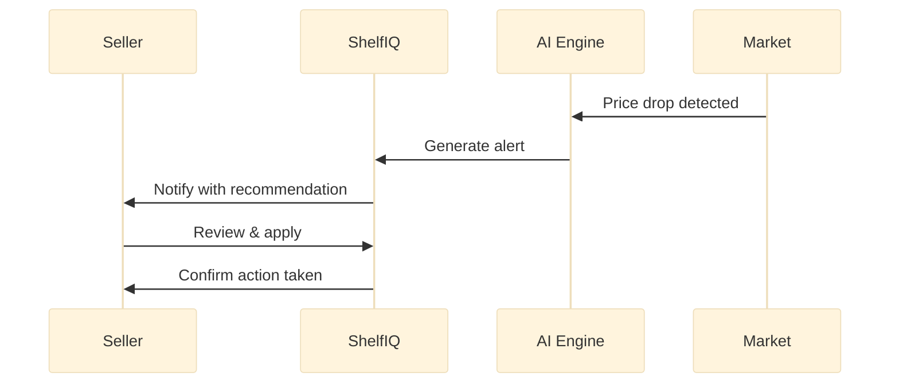
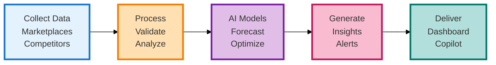
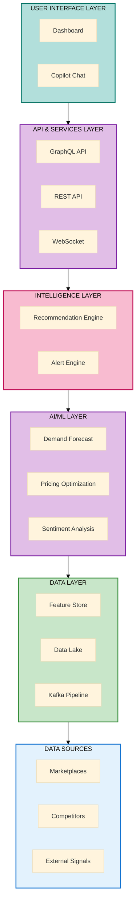
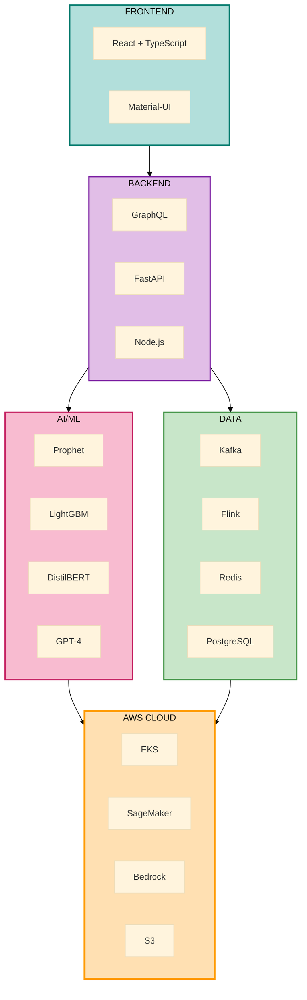
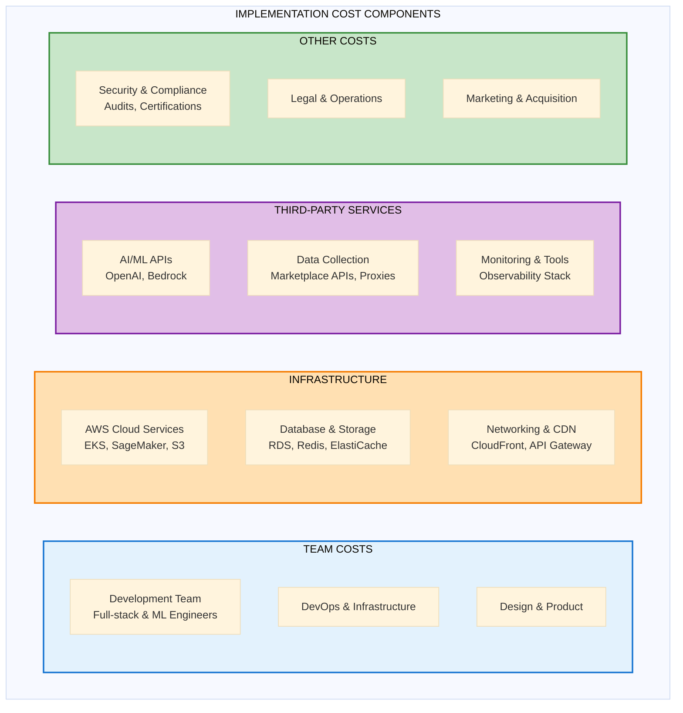
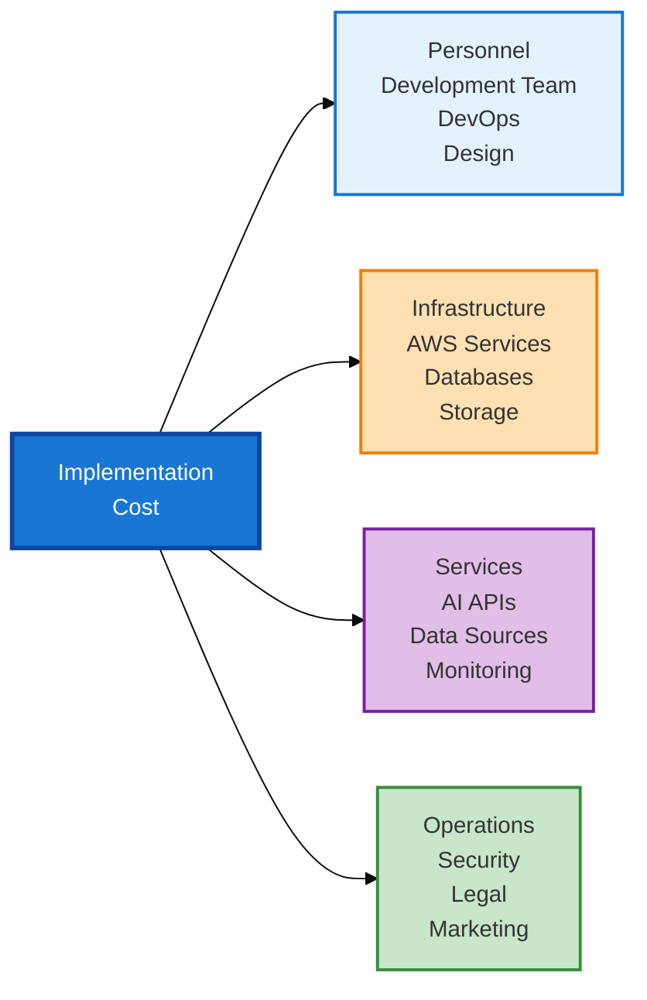
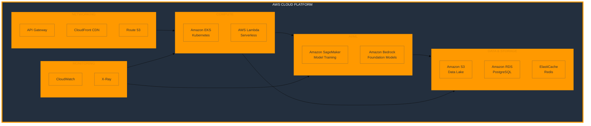
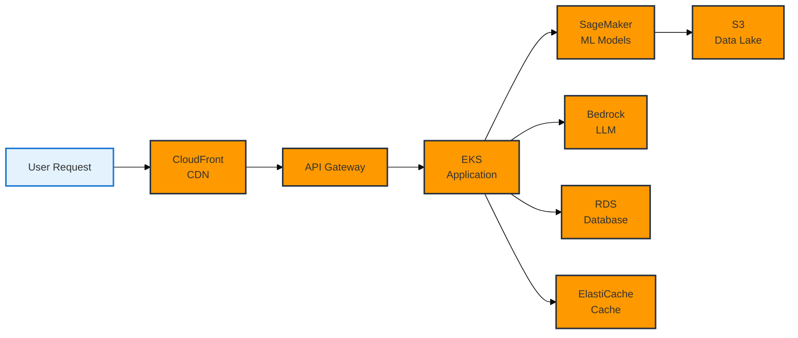

# ShelfIQ Presentation Diagrams - Optimized & Clean

## Simplified diagrams that fit perfectly in PowerPoint slides

---

## SLIDE 5: PROCESS FLOW / USE CASE DIAGRAM

### OPTION A: User Journey Flow (RECOMMENDED)
**Clean, simple sequence showing seller interaction**



**Export:** mermaid.live → 1200x500px PNG

---

### OPTION B: Simple Process Flow (ALTERNATIVE)
**Horizontal flow with better spacing**



**Export:** mermaid.live → 1400x350px PNG

---

## SLIDE 6: WIREFRAMES/MOCKUPS

### Dashboard Wireframe - Simplified ChatGPT Prompt

```
Create a clean, minimal web dashboard wireframe in landscape format (1600x700px).

LAYOUT:

TOP BAR (50px):
- "ShelfIQ" logo (left)
- Search bar (center)
- Bell icon, Profile (right)

MAIN CONTENT - TWO COLUMNS:

LEFT (65%):
- 4 KPI CARDS in one row:
  Revenue | Margin | Market Share | Alerts
  (show values with up/down arrows)

- LARGE CHART below:
  Simple line chart showing revenue trend
  Clean axes, minimal labels

RIGHT (35%):
- "Top Opportunities" panel:
  3 items with icons and brief text

- "Recent Alerts" panel:
  3 items with colored status dots

STYLE:
- Minimal, clean design
- Light gray background (#F5F5F5)
- White cards with subtle shadows
- Blue primary color (#1976D2)
- Professional SaaS look
- Readable fonts
- Plenty of white space

OUTPUT: PNG, 1600x700px, landscape
```

---

## SLIDE 7: ARCHITECTURE DIAGRAM

### Simplified System Architecture (CLEAN VERSION)

```mermaid
%%{init: {'theme':'base', 'themeVariables': {'fontSize':'14px'}}}%%
graph LR
    subgraph Sources[" DATA SOURCES "]
        A1[Marketplaces]
        A2[Scrapers]
        A3[Signals]
    end

    subgraph Pipeline[" PIPELINE "]
        B1[Kafka]
        B2[Flink]
    end

    subgraph Storage[" STORAGE "]
        C1[Redis]
        C2[S3]
    end

    subgraph AI[" AI/ML "]
        D1[Forecast]
        D2[Pricing]
        D3[Sentiment]
    end

    subgraph App[" APPLICATION "]
        E1[API]
        E2[Dashboard]
        E3[Copilot]
    end

    Sources --> Pipeline
    Pipeline --> Storage
    Storage --> AI
    AI --> App

    style Sources fill:#E3F2FD,stroke:#1976D2,stroke-width:2px
    style Pipeline fill:#FFE0B2,stroke:#F57C00,stroke-width:2px
    style Storage fill:#C8E6C9,stroke:#388E3C,stroke-width:2px
    style AI fill:#E1BEE7,stroke:#7B1FA2,stroke-width:2px
    style App fill:#B2DFDB,stroke:#00796B,stroke-width:2px
```



**Export:** mermaid.live → 1400x500px PNG

---

### ALTERNATIVE: Layered Architecture (VERTICAL)



**Export:** mermaid.live → 1000x800px PNG

---

## SLIDE 8: TECHNOLOGIES USED

### Tech Stack - Compact Version



**Export:** mermaid.live → 1200x700px PNG

---

## SLIDE 9: ESTIMATED IMPLEMENTATION COST

### Cost Breakdown - Visual Representation (NO NUMBERS)



**Export:** mermaid.live → 1400x700px PNG

---

### ALTERNATIVE: Cost Categories (Simpler)



**Export:** mermaid.live → 1400x400px PNG

---

### Cost Information - Text Content for Slide

**SLIDE 9 CONTENT (No specific numbers):**

### Implementation Cost Structure

**Development Phase:**
- Core development team (full-stack, ML, DevOps engineers)
- UI/UX design and product management
- Quality assurance and testing

**Infrastructure:**
- AWS cloud services (compute, storage, ML)
- Database and caching infrastructure
- Content delivery and networking

**Third-Party Services:**
- AI/ML API access (GPT-4, foundation models)
- Marketplace API integrations
- Data collection and proxy services
- Monitoring and observability tools

**Operational Costs:**
- Security audits and compliance certifications
- Legal and administrative
- Customer acquisition and marketing

**Cost Optimization Strategies:**
- AWS startup credits program
- Open-source alternatives where feasible
- Spot instances for non-critical workloads
- Reserved instances for production
- Gradual team scaling based on milestones

**Funding Approach:**
- Seed funding for initial development
- Revenue-based scaling post-launch
- Break-even target within operational timeline

---

## SLIDE 10: AWS SERVICES / HACKATHON REQUIREMENTS

### AWS Services Integration - Clean Version



**Export:** mermaid.live → 1400x700px PNG

---

### ALTERNATIVE: AWS Services Flow



**Export:** mermaid.live → 1400x400px PNG

---

## EXPORT SETTINGS FOR ALL DIAGRAMS

### Mermaid Live Editor Settings:
1. Go to https://mermaid.live
2. Paste code
3. Click "Actions" → "PNG"
4. Set appropriate width (specified for each diagram)
5. Choose transparent background
6. Download

### Recommended Dimensions:
- **Horizontal flow diagrams:** 1400x400-500px
- **Vertical/layered diagrams:** 1000-1200x700-800px
- **Complex diagrams:** 1400x700px
- **Simple flows:** 1200-1400x350-500px

### PowerPoint Tips:
1. Insert PNG into slide
2. Position below title (leave ~100px for title)
3. Center align horizontally
4. Maintain aspect ratio when resizing
5. Ensure text is readable from distance

---

## FINAL RECOMMENDATIONS BY SLIDE

| Slide | Recommended Diagram | Dimensions | Tool |
|-------|-------------------|------------|------|
| 5 | User Journey Flow (Option A) | 1200x500 | Mermaid |
| 6 | Dashboard Wireframe | 1600x700 | ChatGPT |
| 7 | Simplified Architecture (Horizontal) | 1400x500 | Mermaid |
| 8 | Tech Stack Compact | 1200x700 | Mermaid |
| 9 | Cost Categories (Simpler) | 1400x400 | Mermaid |
| 10 | AWS Services Integration | 1400x700 | Mermaid |

---

## QUICK GENERATION CHECKLIST

- [ ] Slide 5: Copy User Journey Flow → mermaid.live → Export 1200x500px
- [ ] Slide 6: Copy Dashboard prompt → ChatGPT → Generate → Download
- [ ] Slide 7: Copy Simplified Architecture → mermaid.live → Export 1400x500px
- [ ] Slide 8: Copy Tech Stack → mermaid.live → Export 1200x700px
- [ ] Slide 9: Copy Cost Categories → mermaid.live → Export 1400x400px
- [ ] Slide 10: Copy AWS Services → mermaid.live → Export 1400x700px

**Total Time: ~45 minutes for all 6 diagrams**

All diagrams are now optimized for PowerPoint with better spacing and cleaner layouts!

