# ShelfIQ Presentation Diagrams - Professional Edition
## Designed by experienced Architect, Product Owner, BA, PM, Developer & UI Specialist

---

## SLIDE 5: PROCESS FLOW DIAGRAM
### Multi-Row Flow - Fits Perfectly in Slide

```mermaid
%%{init: {'theme':'base', 'themeVariables': {'fontSize':'14px'}}}%%
graph TB
    subgraph Row1[" DATA COLLECTION "]
        A1[Marketplace APIs<br/>Amazon • Flipkart • Meesho]
        A2[Web Scraping<br/>Competitor Prices]
        A3[External Data<br/>Weather • Events]
    end

    subgraph Row2[" DATA PROCESSING "]
        B1[Real-time Ingestion<br/>Apache Kafka]
        B2[Stream Processing<br/>Apache Flink]
        B3[Data Validation<br/>Quality Checks]
    end

    subgraph Row3[" STORAGE & FEATURES "]
        C1[Feature Store<br/>Redis - Fast Access]
        C2[Data Lake<br/>S3 - Historical Data]
        C3[Feature Engineering<br/>ML-Ready Data]
    end

    subgraph Row4[" AI/ML INTELLIGENCE "]
        D1[Demand Forecasting<br/>Prophet + LightGBM]
        D2[Pricing Optimization<br/>Bayesian Models]
        D3[Sentiment Analysis<br/>DistilBERT]
        D4[Anomaly Detection<br/>Isolation Forest]
    end

    subgraph Row5[" INTELLIGENCE LAYER "]
        E1[Recommendation Engine<br/>Pricing + Listing]
        E2[Alert Engine<br/>Priority Scoring]
        E3[Analytics Engine<br/>Insights Generation]
    end

    subgraph Row6[" USER DELIVERY "]
        F1[API Layer<br/>GraphQL + REST]
        F2[Web Dashboard<br/>React Interface]
        F3[AI Copilot<br/>Chat Assistant]
    end

    A1 --> B1
    A2 --> B1
    A3 --> B1
    B1 --> B2
    B2 --> B3
    B3 --> C1
    B3 --> C2
    C1 --> C3
    C2 --> C3
    C3 --> D1
    C3 --> D2
    C3 --> D3
    C3 --> D4
    D1 --> E1
    D2 --> E1
    D3 --> E2
    D4 --> E2
    E1 --> F1
    E2 --> F1
    E3 --> F1
    F1 --> F2
    F1 --> F3

    style Row1 fill:#E3F2FD,stroke:#1976D2,stroke-width:2px
    style Row2 fill:#FFE0B2,stroke:#F57C00,stroke-width:2px
    style Row3 fill:#C8E6C9,stroke:#388E3C,stroke-width:2px
    style Row4 fill:#E1BEE7,stroke:#7B1FA2,stroke-width:2px
    style Row5 fill:#F8BBD0,stroke:#C2185B,stroke-width:2px
    style Row6 fill:#B2DFDB,stroke:#00796B,stroke-width:2px
```



**Export Settings:**
- Tool: mermaid.live
- Dimensions: 1200x900px
- Format: PNG, transparent background
- This multi-row layout shows complete flow without being too wide

---

### ALTERNATIVE: 3-Column Process Flow (Cleaner)


**Export Settings:**
- Dimensions: 1400x700px
- This 3-column layout is cleaner and more presentation-friendly

---

## SLIDE 6: WIREFRAMES/MOCKUPS
### Dashboard Wireframe - Professional UI Design

**ChatGPT/DALL-E Prompt (Optimized by UI Specialist):**

```
Create a professional SaaS dashboard wireframe in landscape format (1600x700px) optimized for presentation.

DESIGN PHILOSOPHY:
- Clean, modern, data-driven interface
- Information hierarchy: KPIs → Trends → Actions
- Scannable in 5 seconds
- Professional business aesthetic

LAYOUT STRUCTURE:

HEADER (50px height):
├─ Left: "ShelfIQ" logo + icon
├─ Center: Global search bar (compact)
└─ Right: Notifications (badge: 15) | Profile avatar | Settings

MAIN DASHBOARD AREA:

TOP SECTION - KPI CARDS (4 cards, equal width, 120px height):
┌─────────────┬─────────────┬─────────────┬─────────────┐
│ Revenue     │ Margin      │ Market Share│ Alerts      │
│ ₹2.4L       │ 18.5%       │ 23.4%       │ 15          │
│ ↑ +12%      │ ↓ -2.1%     │ ↑ +5.2%     │ 🔴 3 Critical│
└─────────────┴─────────────┴─────────────┴─────────────┘

MIDDLE SECTION - SPLIT LAYOUT:

LEFT COLUMN (65% width):
┌─────────────────────────────────────────┐
│ Revenue Trend (Last 30 Days)            │
│ ┌─────────────────────────────────────┐ │
│ │                                     │ │
│ │  [Clean line chart trending up]    │ │
│ │  Simple axes, minimal grid         │ │
│ │                                     │ │
│ └─────────────────────────────────────┘ │
│ Tabs: 7D | 30D (active) | 90D          │
└─────────────────────────────────────────┘

RIGHT COLUMN (35% width):
┌─────────────────────────────┐
│ Top Opportunities           │
│ ─────────────────────────── │
│ 💡 Increase price SKU-1234  │
│    Expected: +₹2.5K/week    │
│                             │
│ 🎯 Optimize listing 5678    │
│    Expected: +15% visibility│
│                             │
│ 📦 Restock SKU-9012         │
│    Risk: Stockout in 7 days │
└─────────────────────────────┘

┌─────────────────────────────┐
│ Recent Alerts               │
│ ─────────────────────────── │
│ 🔴 Competitor price drop    │
│    SKU-5678 | 5 min ago     │
│                             │
│ 🟡 Demand spike detected    │
│    SKU-9012 | 1 hour ago    │
│                             │
│ 🟢 Margin improved          │
│    SKU-3456 | 2 hours ago   │
└─────────────────────────────┘

DESIGN SPECIFICATIONS:
- Background: Light gray (#F5F5F5)
- Cards: White (#FFFFFF) with 2px shadow
- Primary color: Blue (#1976D2)
- Success: Green (#4CAF50)
- Warning: Orange (#FF9800)
- Error: Red (#F44336)
- Typography: Clean sans-serif, 12-16px
- Spacing: 16px padding, 12px gaps
- Border radius: 8px on all cards
- Icons: Material Design style

VISUAL HIERARCHY:
1. KPIs (largest, top)
2. Main chart (prominent, left)
3. Action items (right, scannable)
4. Consistent alignment and spacing

OUTPUT: PNG, 1600x700px, landscape, presentation-ready
```

---

## SLIDE 7: ARCHITECTURE DIAGRAM
### System Architecture - Enterprise View

```mermaid
%%{init: {'theme':'base', 'themeVariables': {'fontSize':'13px'}}}%%
graph LR
    subgraph Input[" 📥 DATA SOURCES "]
        direction TB
        I1[Marketplaces<br/>APIs]
        I2[Web<br/>Scrapers]
        I3[External<br/>Signals]
    end

    subgraph Pipeline[" ⚙️ DATA PIPELINE "]
        direction TB
        P1[Kafka<br/>Streaming]
        P2[Flink<br/>Processing]
    end

    subgraph Storage[" 💾 STORAGE "]
        direction TB
        S1[Redis<br/>Feature Store]
        S2[S3<br/>Data Lake]
    end

    subgraph AI[" 🤖 AI/ML MODELS "]
        direction TB
        A1[Demand<br/>Forecast]
        A2[Pricing<br/>Engine]
        A3[Sentiment<br/>Analysis]
    end

    subgraph Intel[" 💡 INTELLIGENCE "]
        direction TB
        IN1[Recommendation<br/>Engine]
        IN2[Alert<br/>Engine]
    end

    subgraph App[" 🖥️ APPLICATION "]
        direction TB
        AP1[API<br/>Layer]
        AP2[Dashboard]
        AP3[Copilot]
    end

    Input ==> Pipeline
    Pipeline ==> Storage
    Storage ==> AI
    AI ==> Intel
    Intel ==> App

    style Input fill:#E3F2FD,stroke:#1976D2,stroke-width:3px
    style Pipeline fill:#FFE0B2,stroke:#F57C00,stroke-width:3px
    style Storage fill:#C8E6C9,stroke:#388E3C,stroke-width:3px
    style AI fill:#E1BEE7,stroke:#7B1FA2,stroke-width:3px
    style Intel fill:#F8BBD0,stroke:#C2185B,stroke-width:3px
    style App fill:#B2DFDB,stroke:#00796B,stroke-width:3px
```



**Export Settings:**
- Dimensions: 1400x500px
- Clean horizontal flow with icons
- Perfect for architecture overview

---

## SLIDE 8: TECHNOLOGIES USED
### Tech Stack - Organized by Layer


**Export Settings:**
- Dimensions: 1200x800px
- Shows complete tech stack in organized layers

---

## SLIDE 9: ESTIMATED IMPLEMENTATION COST
### Cost Structure - Horizontal Layout (NO NUMBERS)

```mermaid
%%{init: {'theme':'base', 'themeVariables': {'fontSize':'14px'}}}%%
graph LR
    A[💰 Implementation<br/>Cost Structure] --> B[👥 Personnel<br/>────────<br/>Development Team<br/>ML Engineers<br/>DevOps<br/>Design & Product]

    A --> C[☁️ Infrastructure<br/>────────<br/>AWS Services<br/>Databases<br/>Storage<br/>Networking]

    A --> D[🔌 Services<br/>────────<br/>AI/ML APIs<br/>Data Sources<br/>Monitoring Tools<br/>Security]

    A --> E[📊 Operations<br/>────────<br/>Compliance<br/>Legal<br/>Marketing<br/>Support]

    style A fill:#1976D2,stroke:#0D47A1,stroke-width:4px,color:#fff,font-size:16px
    style B fill:#E3F2FD,stroke:#1976D2,stroke-width:3px
    style C fill:#FFE0B2,stroke:#F57C00,stroke-width:3px
    style D fill:#E1BEE7,stroke:#7B1FA2,stroke-width:3px
    style E fill:#C8E6C9,stroke:#388E3C,stroke-width:3px
```



**Export Settings:**
- Dimensions: 1400x400px
- Clean horizontal layout, fits perfectly in slide
- No numbers, just categories

---

### ALTERNATIVE: Cost Grid Layout

```mermaid
%%{init: {'theme':'base', 'themeVariables': {'fontSize':'13px'}}}%%
graph TB
    subgraph Top[" MAJOR COST CATEGORIES "]
        direction LR

        subgraph Personnel[" 👥 PERSONNEL "]
            P1[Development<br/>Team]
            P2[ML<br/>Engineers]
            P3[DevOps]
            P4[Design &<br/>Product]
        end

        subgraph Infrastructure[" ☁️ INFRASTRUCTURE "]
            I1[AWS Cloud<br/>Services]
            I2[Databases &<br/>Storage]
            I3[Networking &<br/>CDN]
        end
    end

    subgraph Bottom[" SUPPORTING COSTS "]
        direction LR

        subgraph Services[" 🔌 SERVICES "]
            S1[AI/ML<br/>APIs]
            S2[Data<br/>Sources]
            S3[Monitoring<br/>Tools]
        end

        subgraph Operations[" 📊 OPERATIONS "]
            O1[Security &<br/>Compliance]
            O2[Legal &<br/>Admin]
            O3[Marketing &<br/>Acquisition]
        end
    end

    style Personnel fill:#E3F2FD,stroke:#1976D2,stroke-width:2px
    style Infrastructure fill:#FFE0B2,stroke:#F57C00,stroke-width:2px
    style Services fill:#E1BEE7,stroke:#7B1FA2,stroke-width:2px
    style Operations fill:#C8E6C9,stroke:#388E3C,stroke-width:2px
```



**Export Settings:**
- Dimensions: 1400x500px
- Grid layout, balanced and professional

---

### Cost Information - Professional Content

**SLIDE 9 TEXT CONTENT:**

### Implementation Investment Structure

**Primary Investment Areas:**

**Personnel (Largest Component)**
- Core development team: Full-stack, ML, and DevOps engineers
- Product and design leadership
- Quality assurance and testing specialists
- Phased hiring aligned with development milestones

**Cloud Infrastructure**
- AWS managed services (EKS, SageMaker, Bedrock)
- Database and caching infrastructure (RDS, ElastiCache)
- Storage and data lake (S3)
- Content delivery and networking (CloudFront, API Gateway)

**Third-Party Services**
- AI/ML API access (foundation models, specialized APIs)
- Marketplace API integrations and data access
- Web scraping infrastructure and proxy services
- Monitoring, observability, and security tools

**Operational Expenses**
- Security audits and compliance certifications (SOC 2)
- Legal, administrative, and business operations
- Customer acquisition and marketing initiatives
- Customer support infrastructure

**Cost Optimization Strategy:**
- Leverage AWS startup credits and programs
- Utilize open-source technologies where appropriate
- Implement spot instances for non-critical workloads
- Reserved instances for production environments
- Gradual team scaling based on revenue milestones
- Revenue-based growth post-launch

**Funding Approach:**
- Seed funding for MVP and initial market validation
- Milestone-based investment for scaling
- Target operational sustainability within planned timeline

---

## SLIDE 10: AWS SERVICES / HACKATHON ALIGNMENT
### AWS Integration - Comprehensive View


**Export Settings:**
- Dimensions: 1300x900px
- Comprehensive AWS service coverage
- Shows deep integration for hackathon judges

---

### ALTERNATIVE: AWS Services by Category (Cleaner)


**Export Settings:**
- Dimensions: 1400x500px
- Cleaner, more compact for slides

---

## PROFESSIONAL EXPORT GUIDE

### Mermaid Live Editor Workflow:
1. Navigate to https://mermaid.live
2. Clear existing code
3. Paste diagram code
4. Preview renders automatically
5. Click "Actions" → "PNG"
6. Set width as specified for each diagram
7. Select "Transparent" background (or white if preferred)
8. Click "Download PNG"
9. Save with descriptive name (e.g., "slide5_process_flow.png")

### ChatGPT/DALL-E Workflow:
1. Open ChatGPT (ensure GPT-4 with DALL-E access)
2. Copy entire prompt including specifications
3. Paste and submit
4. Review generated image
5. If adjustments needed, provide specific feedback:
   - "Make the KPI cards larger"
   - "Increase spacing between sections"
   - "Use more professional colors"
6. Download final PNG
7. Save with descriptive name

### PowerPoint Integration:
1. Open presentation
2. Navigate to target slide
3. Insert → Pictures → select PNG file
4. Position below title (leave ~100-120px for title)
5. Center align horizontally
6. Resize if needed (hold Shift to maintain aspect ratio)
7. Ensure text is readable
8. Add subtle shadow if needed (Format → Picture Effects)

---

## FINAL RECOMMENDATIONS - PROFESSIONAL PERSPECTIVE

### As an Architect:
- **Slide 7:** Use horizontal architecture diagram - shows system design clearly
- Focus on component relationships, not implementation details

### As a Product Owner:
- **Slide 5:** Use 3-column process flow - tells the product story
- Shows value creation from input to output

### As a Business Analyst:
- **Slide 9:** Use horizontal cost structure - clear business case
- No numbers avoids commitment, shows thinking

### As a Product Manager:
- **Slide 6:** Dashboard wireframe is critical - shows the product
- Demonstrates user value and interface quality

### As a Developer:
- **Slide 8:** Layered tech stack - shows technical competency
- Demonstrates understanding of modern architecture

### As a Marketing Specialist:
- **Slide 10:** AWS services diagram - appeals to hackathon judges
- Shows alignment with AWS ecosystem

### As a Game UI Developer:
- All diagrams: Clean, scannable, visually hierarchical
- Color coding aids quick comprehension
- Consistent styling creates professional impression

---

## RECOMMENDED DIAGRAM SET

| Slide | Diagram | Dimensions | Why This Works |
|-------|---------|------------|----------------|
| 5 | 3-Column Process Flow | 1400x700 | Clear stages, not overwhelming |
| 6 | Dashboard Wireframe | 1600x700 | Shows product value immediately |
| 7 | Horizontal Architecture | 1400x500 | Clean system overview |
| 8 | Layered Tech Stack | 1200x800 | Organized, comprehensive |
| 9 | Horizontal Cost Structure | 1400x400 | Simple, no false numbers |
| 10 | AWS Services by Category | 1400x500 | Clean, judge-friendly |

**Total Generation Time: ~60 minutes**
**Professional Quality: Enterprise-grade presentation**

---

## QUALITY CHECKLIST

Before finalizing each diagram:
- [ ] Fits in slide with title (doesn't overflow)
- [ ] Text is readable from 10 feet away
- [ ] Color scheme is consistent across all diagrams
- [ ] Information hierarchy is clear
- [ ] No unnecessary complexity
- [ ] Professional appearance
- [ ] Aligns with brand colors (blue, orange, green, purple)
- [ ] File size under 2MB
- [ ] PNG format with appropriate background
- [ ] Tested on actual presentation display

**You now have enterprise-quality diagrams designed by a seasoned professional! 🎯**

