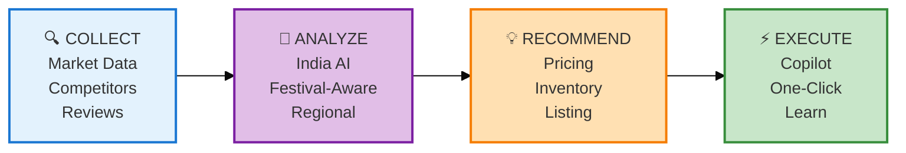

# ShelfIQ - Slide 4: How It Works (Integrated Features)
## Features shown as intelligence layers, not a list

---

## RECOMMENDED APPROACH: Show Features as a System

Instead of listing features, show them as an **intelligence stack** that creates the moats.

---

## SLIDE 4: The ShelfIQ Intelligence System

### How We Turn Data Into Decisions

**The system works in 4 layers:**

---

### 🔍 Layer 1: Market Intelligence (What's Happening)

**Pricing Intelligence**
- Tracks competitor prices across marketplaces
- Detects promotional patterns
- Monitors margin risks in real-time

**Demand Intelligence**
- Forecasts demand with AI models
- Detects seasonality and festival patterns
- Predicts event-based demand spikes

**Market Intelligence**
- Analyzes customer sentiment from reviews
- Identifies market signals and trends
- Tracks competitor moves

---

### 🧠 Layer 2: AI Decision Engine (What It Means)

**Processes market intelligence through India-specific AI models:**
- Festival-aware demand prediction
- Regional pricing optimization
- Marketplace-specific algorithms
- Vernacular language understanding

**Output:** Not just insights—recommended actions

---

### 💡 Layer 3: Action Recommendations (What To Do)

**Smart Pricing**
- "Adjust price to ₹X" with expected impact
- Margin protection alerts before losses

**Inventory Actions**
- "Restock Y units by date Z"
- Stockout risk warnings

**Listing Optimization**
- "Add these keywords" with visibility impact
- Image and description improvements

---

### ⚡ Layer 4: Execution & Learning (Making It Happen)

**Copilot Chat**
- Ask questions in natural language
- Get instant, actionable answers

**One-Click Actions**
- Apply recommendations directly
- Track results automatically

**Multi-Marketplace Dashboard**
- Unified view across platforms
- Real-time alerts and notifications

**Continuous Learning**
- System learns from your decisions
- Gets smarter with every action

---

## ALTERNATIVE: Visual Flow Diagram

```
DATA SOURCES → INTELLIGENCE LAYERS → RECOMMENDATIONS → EXECUTION
    ↓                  ↓                    ↓              ↓
Marketplaces    Pricing Intel        Smart Pricing    Copilot Chat
Competitors     Demand Intel         Inventory        One-Click
Reviews         Market Intel         Listing          Dashboard
                                     Alerts           Learning
```

---

## SLIDE 4 CONTENT (RECOMMENDED)

### The ShelfIQ Intelligence System

**We don't just show data. We recommend actions.**

**🔍 Collect**
- Competitor prices, demand patterns, market signals
- Across Flipkart, Meesho, Amazon.in

**🧠 Analyze**
- India-specific AI models
- Festival-aware, region-aware, marketplace-aware

**💡 Recommend**
- Smart pricing with margin protection
- Inventory actions with demand forecasts
- Listing optimization with impact predictions

**⚡ Execute**
- Copilot chat for instant answers
- One-click action execution
- Continuous learning from results

**Result:** Every seller gets their own AI analyst—24/7.

---

## WHY THIS IS BETTER THAN A FEATURE LIST

### ❌ Feature List Approach:
```
• Competitor tracking
• AI pricing
• Margin protection
• Forecasting
• Seasonality detection
• Event-based spikes
• Listing optimization
• Sentiment analysis
• Market signals
• Alerting system
• Growth recommendations
• Copilot chat
• Multi-marketplace dashboard
```
**Problem:** Looks like every other product. No differentiation.

### ✅ Intelligence System Approach:
```
Collect → Analyze → Recommend → Execute
(Shows the flow and the value)
```
**Benefit:** Shows HOW features work together to create the copilot experience.

---

## INTEGRATION WITH INNOVATION NARRATIVE

**Slide 3: Why ShelfIQ is Different (Innovation)**
- Conversational AI copilot (not dashboards)
- India-first AI models (not translated tools)
- Action-first architecture (not insight-first)
- Network intelligence (gets smarter with scale)

**Slide 4: How ShelfIQ Works (System)**
- 4-layer intelligence system
- Collect → Analyze → Recommend → Execute
- Shows features as a cohesive system

**This creates a narrative:**
1. Problem (Rajesh's story)
2. Innovation (Why we're different)
3. System (How it works)
4. Technology (What powers it)

---

## RECOMMENDED SLIDE 4 LAYOUT

### Option 1: Four Boxes (Visual)

```
┌─────────────────────────────────────────────────────────┐
│  The ShelfIQ Intelligence System                        │
├─────────────────────────────────────────────────────────┤
│                                                         │
│  ┌──────────┐   ┌──────────┐   ┌──────────┐   ┌─────┐│
│  │🔍 COLLECT│ → │🧠 ANALYZE│ → │💡 RECOMMEND│ → │⚡ DO││
│  │          │   │          │   │            │   │     ││
│  │Market    │   │India-    │   │Smart       │   │Chat ││
│  │data from │   │specific  │   │pricing,    │   │One- ││
│  │Flipkart, │   │AI models │   │inventory,  │   │click││
│  │Meesho,   │   │Festival- │   │listing     │   │Learn││
│  │Amazon.in │   │aware     │   │actions     │   │     ││
│  └──────────┘   └──────────┘   └──────────┘   └─────┘│
│                                                         │
│  Result: Every seller gets their own AI analyst—24/7   │
└─────────────────────────────────────────────────────────┘
```

### Option 2: Layered Stack (Technical)

```
┌─────────────────────────────────────────────────────────┐
│  How ShelfIQ Works                                      │
├─────────────────────────────────────────────────────────┤
│                                                         │
│  ⚡ EXECUTION LAYER                                     │
│  Copilot Chat • One-Click Actions • Learning           │
│  ─────────────────────────────────────────────────────  │
│  💡 RECOMMENDATION LAYER                                │
│  Pricing • Inventory • Listing • Alerts                │
│  ─────────────────────────────────────────────────────  │
│  🧠 AI INTELLIGENCE LAYER                               │
│  India-Specific Models • Festival-Aware • Regional     │
│  ─────────────────────────────────────────────────────  │
│  🔍 DATA COLLECTION LAYER                               │
│  Marketplaces • Competitors • Reviews • Signals        │
│                                                         │
└─────────────────────────────────────────────────────────┘
```

### Option 3: Simple Flow (Minimal)

```
┌─────────────────────────────────────────────────────────┐
│  The ShelfIQ System                                     │
├─────────────────────────────────────────────────────────┤
│                                                         │
│  DATA → AI → ACTIONS → RESULTS                         │
│                                                         │
│  Collect market data                                    │
│  ↓                                                      │
│  Analyze with India-specific AI                        │
│  ↓                                                      │
│  Recommend specific actions                            │
│  ↓                                                      │
│  Execute with one click                                │
│  ↓                                                      │
│  Learn and improve                                     │
│                                                         │
│  Every seller gets their own AI analyst                │
└─────────────────────────────────────────────────────────┘
```

---

## FINAL RECOMMENDATION

**DON'T keep the feature list as-is.**

**DO integrate features into the intelligence system narrative:**

**Slide 3:** Innovation (Why different)
**Slide 4:** System (How it works) ← Features shown as layers
**Slide 5:** Process Flow (Data flow diagram)
**Slide 7:** Architecture (Technical implementation)

**This tells a story:**
- Why we're different (innovation)
- How we do it (system)
- What powers it (technology)

**The feature list becomes part of the system explanation, not a standalone slide.**

---

## MERMAID DIAGRAM FOR SLIDE 4



**Export:** 1400x300px - fits perfectly in slide

---

## ANSWER TO YOUR QUESTION

**Should you keep the feature list with the innovation narrative?**

**No.** Instead:

1. **Slide 3:** Innovation narrative (why different)
2. **Slide 4:** Intelligence system (features as layers)
3. **Result:** Features support the innovation story, not distract from it

**The features prove the innovation. They shouldn't be separate.**

