# ShelfIQ - Technical Architecture & Hackathon Requirements
## Professional Diagrams for Presentation

---

## SLIDE 7: TECHNICAL ARCHITECTURE DIAGRAM
### Production-Ready Architecture with AWS Services


**Export Settings:**
- Dimensions: 1400x900px
- Tool: mermaid.live
- Format: PNG, transparent background
- This shows complete production architecture with AWS services

---

### ALTERNATIVE: Simplified Technical Architecture (Cleaner for Slides)

```mermaid
%%{init: {'theme':'base', 'themeVariables': {'fontSize':'13px'}}}%%
graph LR
    subgraph Input[" 📱 USER ACCESS "]
        U[Sellers<br/>Dashboard/Copilot]
    end

    subgraph Edge[" 🌐 EDGE "]
        CF[CloudFront<br/>CDN]
        AG[API Gateway]
    end

    subgraph App[" 🖥️ APPLICATION<br/>Amazon EKS "]
        K8[Kubernetes<br/>Microservices]
    end

    subgraph Intel[" 🤖 AI/ML "]
        SM[SageMaker<br/>ML Models]
        BR[Bedrock<br/>LLM Copilot]
    end

    subgraph Store[" 💾 STORAGE "]
        RDS[(RDS<br/>PostgreSQL)]
        REDIS[(ElastiCache<br/>Redis)]
        S3[(S3<br/>Data Lake)]
    end

    subgraph Ops[" 📊 OPERATIONS "]
        GLUE[Glue<br/>ETL]
        CW[CloudWatch<br/>Monitoring]
        XR[X-Ray<br/>Tracing]
    end

    U --> Edge
    Edge --> App
    App --> Intel
    App --> Store
    Intel --> Store
    Store --> Ops

    style Input fill:#E3F2FD,stroke:#1976D2,stroke-width:2px
    style Edge fill:#FFE0B2,stroke:#FF9900,stroke-width:3px
    style App fill:#FFE0B2,stroke:#FF9900,stroke-width:3px
    style Intel fill:#FFE0B2,stroke:#FF9900,stroke-width:3px
    style Store fill:#FFE0B2,stroke:#FF9900,stroke-width:3px
    style Ops fill:#F8BBD0,stroke:#C2185B,stroke-width:2px
```



**Export Settings:**
- Dimensions: 1400x500px
- Cleaner, more presentation-friendly
- All AWS services highlighted in orange

---

## SLIDE 10: HACKATHON REQUIREMENTS - AWS SERVICES

### AWS Services Architecture (Visual with Logos)

```mermaid
%%{init: {'theme':'base', 'themeVariables': {'fontSize':'13px'}}}%%
graph TB
    subgraph AWS[" ☁️ AWS CLOUD SERVICES USED IN SHELFIQ "]

        subgraph ML[" 🤖 AI/ML SERVICES "]
            direction LR
            SM[Amazon SageMaker<br/>━━━━━━━━━━━━<br/>ML Model Training<br/>Model Deployment<br/>Endpoint Hosting]
            BR[Amazon Bedrock<br/>━━━━━━━━━━━━<br/>Foundation Models<br/>LLM Integration<br/>Copilot Chat]
        end

        subgraph Compute[" 🖥️ COMPUTE & ORCHESTRATION "]
            direction LR
            EKS[Amazon EKS<br/>━━━━━━━━━━━━<br/>Kubernetes Cluster<br/>Container Orchestration<br/>Auto-scaling]
        end

        subgraph DataStore[" 💾 DATA & STORAGE "]
            direction LR
            RDS[Amazon RDS<br/>━━━━━━━━━━━━<br/>PostgreSQL<br/>Transactional Data<br/>High Availability]
            REDIS[ElastiCache<br/>━━━━━━━━━━━━<br/>Redis Cluster<br/>Feature Store<br/>Sub-ms Latency]
            S3[Amazon S3<br/>━━━━━━━━━━━━<br/>Data Lake<br/>Parquet Storage<br/>Lifecycle Policies]
        end

        subgraph DataOps[" ⚙️ DATA OPERATIONS "]
            direction LR
            GLUE[AWS Glue<br/>━━━━━━━━━━━━<br/>ETL Jobs<br/>Data Catalog<br/>Schema Registry]
        end

        subgraph Network[" 🌐 NETWORKING & DELIVERY "]
            direction LR
            APIG[API Gateway<br/>━━━━━━━━━━━━<br/>REST APIs<br/>WebSocket<br/>Rate Limiting]
            CF[CloudFront<br/>━━━━━━━━━━━━<br/>Global CDN<br/>Edge Caching<br/>DDoS Protection]
        end

        subgraph Observe[" 📊 MONITORING & OBSERVABILITY "]
            direction LR
            CW[CloudWatch<br/>━━━━━━━━━━━━<br/>Logs & Metrics<br/>Alarms<br/>Dashboards]
            XR[X-Ray<br/>━━━━━━━━━━━━<br/>Distributed Tracing<br/>Service Map<br/>Performance]
        end
    end

    ML --> Compute
    Compute --> DataStore
    DataStore --> DataOps
    Compute --> Network
    Network --> Observe

    style AWS fill:#232F3E,stroke:#FF9900,stroke-width:4px
    style ML fill:#FF9900,stroke:#232F3E,stroke-width:2px
    style Compute fill:#FF9900,stroke:#232F3E,stroke-width:2px
    style DataStore fill:#FF9900,stroke:#232F3E,stroke-width:2px
    style DataOps fill:#FF9900,stroke:#232F3E,stroke-width:2px
    style Network fill:#FF9900,stroke:#232F3E,stroke-width:2px
    style Observe fill:#FF9900,stroke:#232F3E,stroke-width:2px
```



**Export Settings:**
- Dimensions: 1400x900px
- Shows all AWS services with descriptions
- Perfect for hackathon judges

---

## SLIDE 10: BHARAT-SPECIFIC FEATURES

### India-First Features Diagram

```mermaid
%%{init: {'theme':'base', 'themeVariables': {'fontSize':'13px'}}}%%
graph TB
    subgraph Bharat[" 🇮🇳 BHARAT-SPECIFIC FEATURES "]

        subgraph Lang[" 🗣️ MULTI-LANGUAGE SUPPORT "]
            direction LR
            L1[Hindi<br/>हिंदी]
            L2[Tamil<br/>தமிழ்]
            L3[Telugu<br/>తెలుగు]
            L4[Bengali<br/>বাংলা]
            L5[Marathi<br/>मराठी]
        end

        subgraph Festival[" 🎉 FESTIVAL INTELLIGENCE "]
            direction LR
            F1[Diwali<br/>Demand Prediction]
            F2[Holi<br/>Price Optimization]
            F3[Eid<br/>Inventory Planning]
            F4[Regional Festivals<br/>Pongal, Onam, Durga Puja]
        end

        subgraph Market[" 🛒 INDIAN MARKETPLACES "]
            direction LR
            M1[Flipkart<br/>Integration]
            M2[Meesho<br/>Integration]
            M3[Amazon.in<br/>Integration]
            M4[Future: Myntra<br/>Ajio, Snapdeal]
        end

        subgraph Tier[" 🏘️ TIER 2/3 CITY FOCUS "]
            direction LR
            T1[Affordable Pricing<br/>₹2,999/month]
            T2[Low-Bandwidth UI<br/>Optimized Assets]
            T3[Offline Mode<br/>Sync Later]
            T4[Regional Support<br/>Local Languages]
        end

        subgraph Compliance[" 📋 INDIAN COMPLIANCE "]
            direction LR
            C1[GST Integration<br/>Tax Calculation]
            C2[Indian Payment<br/>UPI, Razorpay]
            C3[Data Residency<br/>India Region]
            C4[RBI Guidelines<br/>Compliance]
        end
    end

    style Bharat fill:#FF9933,stroke:#138808,stroke-width:4px
    style Lang fill:#FFE0B2,stroke:#F57C00,stroke-width:2px
    style Festival fill:#E1BEE7,stroke:#7B1FA2,stroke-width:2px
    style Market fill:#B2DFDB,stroke:#00796B,stroke-width:2px
    style Tier fill:#C8E6C9,stroke:#388E3C,stroke-width:2px
    style Compliance fill:#F8BBD0,stroke:#C2185B,stroke-width:2px
```



**Export Settings:**
- Dimensions: 1400x800px
- Shows India-specific features
- Orange-white-green color scheme (Indian flag colors)

---

## SLIDE 10: SOCIAL IMPACT & INNOVATION

### Social Impact Metrics (Visual Representation)

```mermaid
%%{init: {'theme':'base', 'themeVariables': {'fontSize':'14px'}}}%%
graph LR
    subgraph Impact[" 🎯 SOCIAL IMPACT GOALS "]

        subgraph Target[" 👥 TARGET REACH "]
            T1[10,000+ MSMEs<br/>Empowered<br/>Year 1]
        end

        subgraph Economic[" 💰 ECONOMIC IMPACT "]
            E1[₹50+ Crores<br/>Additional Revenue<br/>for Sellers]
        end

        subgraph Jobs[" 💼 JOB CREATION "]
            J1[500+ New<br/>E-commerce<br/>Businesses]
        end

        subgraph Innovation[" 💡 INNOVATION "]
            I1[First Conversational<br/>AI Copilot for<br/>Indian E-commerce]
        end
    end

    style Impact fill:#1976D2,stroke:#0D47A1,stroke-width:3px
    style Target fill:#E3F2FD,stroke:#1976D2,stroke-width:3px
    style Economic fill:#C8E6C9,stroke:#388E3C,stroke-width:3px
    style Jobs fill:#FFE0B2,stroke:#F57C00,stroke-width:3px
    style Innovation fill:#E1BEE7,stroke:#7B1FA2,stroke-width:3px
```



**Export Settings:**
- Dimensions: 1400x300px
- Clean, impactful metrics display

---

### ALTERNATIVE: Combined Hackathon Requirements (All-in-One)

```mermaid
%%{init: {'theme':'base', 'themeVariables': {'fontSize':'12px'}}}%%
graph TB
    subgraph Main[" 🏆 AWS AI FOR BHARAT HACKATHON - SHELFIQ "]

        subgraph AWS[" ☁️ AWS SERVICES "]
            direction TB
            A1[SageMaker: ML Training]
            A2[Bedrock: LLM Copilot]
            A3[EKS: Orchestration]
            A4[RDS + ElastiCache: DB]
            A5[S3 + Glue: Data Lake]
            A6[CloudWatch + X-Ray: Monitor]
        end

        subgraph Bharat[" 🇮🇳 BHARAT FEATURES "]
            direction TB
            B1[Languages: Hindi, Tamil<br/>Telugu, Bengali, Marathi]
            B2[Festivals: Diwali, Holi<br/>Eid Predictions]
            B3[Markets: Flipkart<br/>Meesho, Amazon.in]
            B4[Tier 2/3: Affordable<br/>Low-bandwidth UI]
            B5[GST: Tax Compliance]
        end

        subgraph Impact[" 🎯 SOCIAL IMPACT "]
            direction TB
            I1[10,000+ MSMEs<br/>Empowered]
            I2[₹50+ Cr Revenue<br/>for Sellers]
            I3[500+ New<br/>Businesses]
        end

        subgraph Innovation[" 💡 INNOVATION "]
            direction TB
            IN1[First AI Copilot<br/>for Indian<br/>E-commerce]
        end
    end

    AWS --> Bharat
    Bharat --> Impact
    Impact --> Innovation

    style Main fill:#232F3E,stroke:#FF9900,stroke-width:4px
    style AWS fill:#FFE0B2,stroke:#FF9900,stroke-width:3px
    style Bharat fill:#FFE0B2,stroke:#FF9900,stroke-width:3px
    style Impact fill:#C8E6C9,stroke:#388E3C,stroke-width:3px
    style Innovation fill:#E1BEE7,stroke:#7B1FA2,stroke-width:3px
```



**Export Settings:**
- Dimensions: 1400x700px
- All hackathon requirements in one diagram
- Perfect for comprehensive overview

---

## SLIDE 10: TEXT CONTENT WITH ICONS

### PowerPoint Slide Layout (Use with or without diagrams)

```
┌─────────────────────────────────────────────────────────────┐
│  AWS AI for Bharat Hackathon - ShelfIQ Alignment           │
├─────────────────────────────────────────────────────────────┤
│                                                             │
│  ☁️ AWS SERVICES USED                                       │
│  ━━━━━━━━━━━━━━━━━━━━━━━━━━━━━━━━━━━━━━━━━━━━━━━━━━━━━━  │
│                                                             │
│  🤖 AI/ML                    💾 Data & Storage             │
│  • SageMaker                 • Amazon S3 (Data Lake)       │
│    ML Training & Deployment  • Amazon RDS (PostgreSQL)     │
│  • Bedrock                   • ElastiCache (Redis)         │
│    LLM for Copilot          • AWS Glue (ETL)              │
│                                                             │
│  🖥️ Compute & Network        📊 Monitoring                 │
│  • Amazon EKS                • CloudWatch (Logs/Metrics)   │
│    Container Orchestration   • X-Ray (Tracing)            │
│  • API Gateway                                             │
│  • CloudFront (CDN)                                        │
│                                                             │
├─────────────────────────────────────────────────────────────┤
│                                                             │
│  🇮🇳 BHARAT-SPECIFIC FEATURES                               │
│  ━━━━━━━━━━━━━━━━━━━━━━━━━━━━━━━━━━━━━━━━━━━━━━━━━━━━━━  │
│                                                             │
│  🗣️ Multi-Language Support   🎉 Festival Intelligence      │
│  • Hindi (हिंदी)             • Diwali demand prediction    │
│  • Tamil (தமிழ்)              • Holi price optimization     │
│  • Telugu (తెలుగు)            • Eid inventory planning     │
│  • Bengali (বাংলা)            • Regional festivals         │
│  • Marathi (मराठी)                                         │
│                                                             │
│  🛒 Indian Marketplaces      🏘️ Tier 2/3 City Focus        │
│  • Flipkart Integration      • Affordable: ₹2,999/month    │
│  • Meesho Integration        • Low-bandwidth optimized UI  │
│  • Amazon.in Integration     • Offline mode support        │
│                                                             │
│  📋 Compliance               💡 Innovation                  │
│  • GST tax integration       • First conversational AI     │
│  • Indian payment methods      copilot for Indian          │
│  • Data residency (India)      e-commerce sellers          │
│                                                             │
├─────────────────────────────────────────────────────────────┤
│                                                             │
│  🎯 SOCIAL IMPACT                                           │
│  ━━━━━━━━━━━━━━━━━━━━━━━━━━━━━━━━━━━━━━━━━━━━━━━━━━━━━━  │
│                                                             │
│  👥 Target: 10,000+ MSMEs empowered in Year 1              │
│  💰 Economic Impact: ₹50+ Crores additional revenue        │
│  💼 Job Creation: Enable 500+ new e-commerce businesses    │
│                                                             │
└─────────────────────────────────────────────────────────────┘
```

---

## CHATGPT/DALL-E PROMPT FOR VISUAL INFOGRAPHIC

### Hackathon Requirements Infographic

```
Create a professional infographic for a hackathon presentation slide in landscape format (1600x700px).

TITLE: "AWS AI for Bharat Hackathon - ShelfIQ"

LAYOUT - 4 QUADRANTS:

TOP LEFT QUADRANT - AWS SERVICES:
Header: "☁️ AWS Services Used"
Icons and text for:
- SageMaker (ML icon)
- Bedrock (AI icon)
- EKS (container icon)
- RDS + ElastiCache (database icon)
- S3 + Glue (storage icon)
- CloudWatch + X-Ray (monitoring icon)
Use AWS orange color (#FF9900)

TOP RIGHT QUADRANT - BHARAT FEATURES:
Header: "🇮🇳 Bharat-Specific Features"
Icons and text for:
- Multi-language (5 Indian languages with native scripts)
- Festival Intelligence (Diwali, Holi, Eid icons)
- Indian Marketplaces (Flipkart, Meesho, Amazon.in logos)
- Tier 2/3 Focus (affordable pricing icon)
- GST Compliance (tax icon)
Use Indian flag colors (orange, white, green)

BOTTOM LEFT QUADRANT - SOCIAL IMPACT:
Header: "🎯 Social Impact"
Large numbers with icons:
- 10,000+ MSMEs (people icon)
- ₹50+ Cr Revenue (money icon)
- 500+ Businesses (growth icon)
Use green color (#388E3C)

BOTTOM RIGHT QUADRANT - INNOVATION:
Header: "💡 Innovation Highlight"
Large text:
"First Conversational AI Copilot for Indian E-commerce"
AI chat icon
Use purple color (#7B1FA2)

DESIGN STYLE:
- Modern, flat design
- Professional business aesthetic
- Clean icons (Material Design style)
- Readable fonts (minimum 14px)
- White background
- Color-coded sections
- Balanced layout
- Plenty of white space

OUTPUT: PNG, 1600x700px, landscape, presentation-ready
```

---

## RECOMMENDED APPROACH FOR SLIDE 10

### Option 1: Single Comprehensive Diagram
Use the "Combined Hackathon Requirements (All-in-One)" Mermaid diagram
- Shows everything in one view
- Dimensions: 1400x700px
- Quick to generate

### Option 2: Multiple Focused Diagrams
Use 2-3 smaller diagrams:
1. AWS Services Architecture (1400x400px)
2. Bharat Features (1400x300px)
3. Social Impact (1400x200px)

### Option 3: Text + Icons Layout
Use the PowerPoint text layout with icons
- No diagram generation needed
- Use PowerPoint's built-in icons
- Faster to create
- Very clean and professional

### Option 4: Professional Infographic
Use ChatGPT/DALL-E to create visual infographic
- Most visually appealing
- Takes longer to generate
- Best for final presentation

---

## FINAL RECOMMENDATIONS

### For Slide 7 (Architecture):
**Use:** Simplified Technical Architecture (1400x500px)
- Shows complete AWS integration
- Clean and professional
- Easy to explain

### For Slide 10 (Hackathon Requirements):
**Best Option:** Combined Hackathon Requirements diagram (1400x700px)
- All information in one view
- Color-coded sections
- Perfect for judges

**Alternative:** Text + Icons layout in PowerPoint
- Faster to create
- Very clean
- Easy to update

---

## EXPORT CHECKLIST

- [ ] Slide 7: Technical Architecture diagram exported
- [ ] Slide 10: Hackathon Requirements diagram exported
- [ ] All diagrams are 1400-1600px wide
- [ ] Text is readable (13-14px minimum)
- [ ] AWS services highlighted in orange
- [ ] India-specific features clearly shown
- [ ] Social impact metrics visible
- [ ] File sizes under 2MB
- [ ] Tested on actual slide

**You now have production-ready technical architecture and hackathon requirement diagrams! 🚀**

